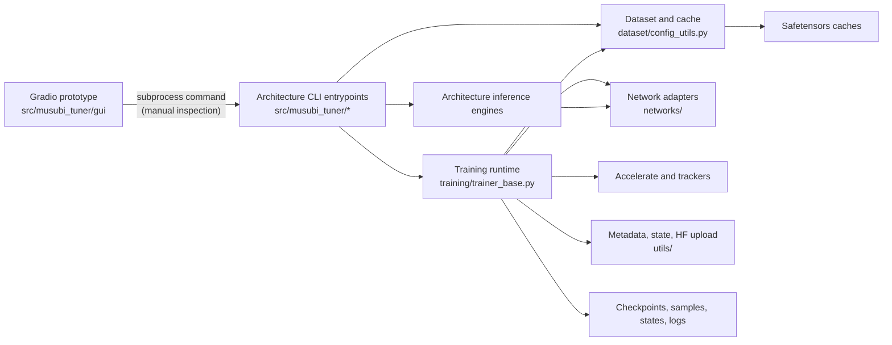
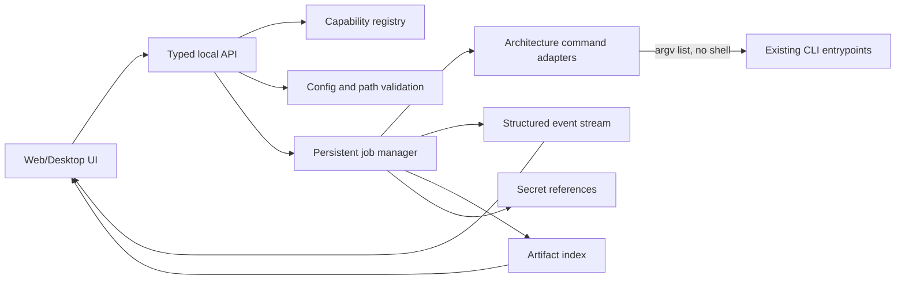

> generated_by: nexus-mapper v2
> verified_at: 2026-07-30
> provenance: Internal Python imports are AST-backed; CLI subprocess calls and target UI adapter boundaries are inferred from file tree and manual inspection and are labeled accordingly; Git history is unavailable.

# 系统依赖

## 当前实现

当前 GUI → CLI 边来自 `gui.py` 的命令构造和 `subprocess.Popen`，属于人工核验；其余主要 Python 依赖由 AST 导入图支持。

## 目标 UI 适配边界

目标边界不是当前实现。它来自 UI 交接需求与已验证缺口：现有代码没有统一能力注册表、任务管理器、事件接口、产物索引或秘密引用层。

## 高影响依赖

| 文件 | AST 影响证据 | 结论 |
|---|---:|---|
| `src/musubi_tuner/dataset/config_utils.py` | 29 个反向依赖 | 数据集 Schema 必须只有一个后端权威，不能在前端重写 |
| `src/musubi_tuner/training/trainer_base.py` | 10 个内部上游、5 个直接反向依赖 | 结构化事件与取消接入点应放在公共训练运行时 |
| `src/musubi_tuner/training/parser_common.py` | 120 个公共参数 | UI 能力 Schema 应从显式注册表生成，不能靠多个表单手抄 |
| `src/musubi_tuner/gui/gui.py` | 2 个内部上游、0 个反向依赖 | 原型与训练核心解耦，适合迁移或替换，不是公共 API |

`query_graph.py` 对部分通过别名或继承形成的运行时关系会低估反向依赖，因此架构入口组合关系又以 `main()` 和 parser 调用链逐一人工复核。
