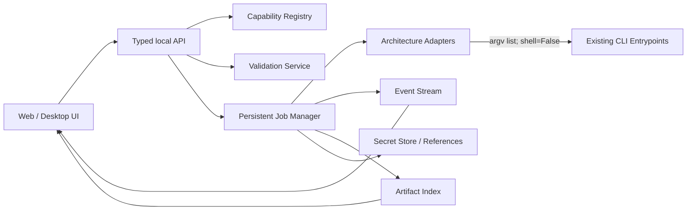
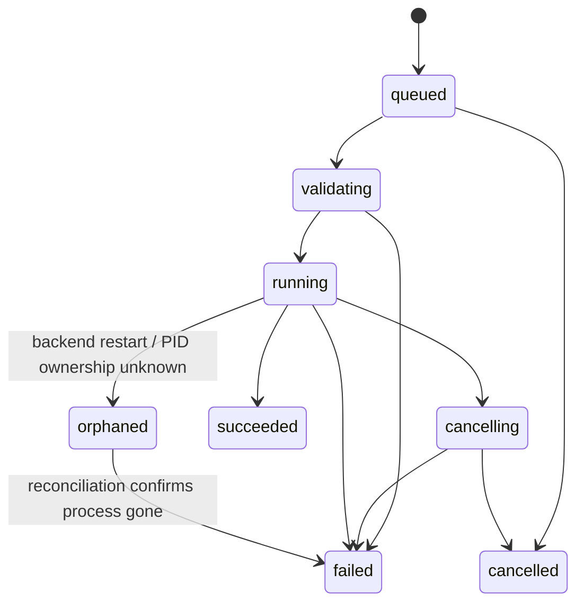

# Musubi Tuner 前端 / GUI 适配深度研究与交接

> 审核日期：2026-07-30  
> 审核目录：`D:\桌面\musubi-tuner-main`  
> 仓库版本：`pyproject.toml` 声明 `0.3.4`；当前快照不含 `.git`，无法确认提交、分支与远端  
> 交付性质：只读研究与 UI 适配交接；未修改训练业务代码，未执行训练、推理或目标仓库测试  
> 机器附件：`.nexus-map/raw/ast_nodes.json`、`.nexus-map/raw/cli_arguments.json`、`.nexus-map/concepts/concept_model.json`

## 1. 结论先行

Musubi Tuner 不是“完全没有 GUI”，而是存在一个**未形成稳定产品入口、能力覆盖非常有限的 Gradio 原型**。原型位于 `src/musubi_tuner/gui/`，只支持 `Qwen-Image` 与 `Z-Image-Turbo`，没有包级启动命令、没有顶层包装器、没有 GUI 测试，而且直接在 UI 回调中读写配置、拼接 shell 命令并启动进程。相关证据见：

- 可选 Gradio 依赖：`pyproject.toml:L46-L48`。
- 仅两个架构选项：`src/musubi_tuner/gui/gui.py:L33-L40`。
- 原计划明确不做进度管理：`src/musubi_tuner/gui/gui_implementation_plan.md:L25`、`L57`。
- `shell=True` 执行字符串命令：`src/musubi_tuner/gui/gui.py:L448-L476`。
- Windows `cmd /c` 新控制台训练：`src/musubi_tuner/gui/gui.py:L923-L935`。
- 仓库没有 `[project.scripts]`、`[project.gui-scripts]` 或 GUI 根包装器。
- `tests/` 没有 GUI、作业状态或取消测试。

真正的稳定产品边界目前是 **CLI + TOML/JSON + 文件系统产物**，而不是 Python API、HTTP API 或 GUI 组件。全仓没有 FastAPI/Flask/ASGI 路由、WebSocket/SSE、持久化作业表或取消接口。

本次静态研究得到的规模如下：

| 范围 | 结果 |
|---|---:|
| Python AST | 278 个文件、87,156 行 |
| AST 图 | 3,500 个节点、5,148 条边 |
| AST 完整性 | 0 个解析错误、无截断 |
| 根目录 CLI 包装器 | 57 个 |
| `src/musubi_tuner` 中含参数接口的文件 | 65 个 |
| `add_argument` 声明 | 925 个 |
| 唯一参数标记 | 360 个 |
| 位置参数声明 | 10 个 |
| 模型架构族 | 12 个 |
| 测试模块 | 13 个、1,913 行 |

因此，未来 UI 不能继续沿用“一个 Gradio 文件按模型写 `if/elif` 并拼命令”的方式。应先建立四个后端边界：

1. **Capability Registry**：权威描述架构、变体、工作流、字段、默认值、条件、危险操作与产物。
2. **Typed Validation/Command Adapter**：接受结构化请求，调用现有 Python 校验，并只渲染 argv 数组。
3. **Persistent Job Manager**：提供 `job_id`、状态、并发控制、取消、退出信息和重启后恢复判断。
4. **Structured Event/Artifact API**：把训练指标、阶段进度、样本、检查点、日志、上传结果与错误变成结构化事件。

在这四层完成前，直接扩写现有 `gui.py` 只会复制 925 个参数声明和大量跨字段规则，后续极易与 CLI 漂移。

## 2. 研究方法、证据等级与限制

### 2.1 使用的证据

| 证据 | 范围 | 用途 |
|---|---|---|
| Tree-sitter AST | 全部 278 个 Python 文件 | 模块、类、函数与 import 图 |
| Python AST 参数抽取 | `src/musubi_tuner` 208 个 Python 文件 | 925 个 `add_argument` 的 flags、作用域、行号、类型、默认值、required、choices、action、nargs、help |
| 手工调用链核验 | 所有缓存、训练、推理、工具入口 | 补足公共 parser、架构 helper、动态 model version 等组合关系 |
| 代码逐段阅读 | GUI、dataset、training、networks、utils | 确认副作用、删除行为、产物、指标、秘密和进程边界 |
| 静态测试盘点 | `tests/` | 判断已有覆盖与 UI 证据缺口 |

参数级机器台账保存在 `.nexus-map/raw/cli_arguments.json`，Schema 为 `musubi-ui-cli-surface/v1`。它包含比本文附录更细的每个参数类型、默认值、choices、required 和 help，可用于后续生成 Capability Registry 的初始迁移清单。

### 2.2 明确限制

- 当前目录没有 `.git`，所以本文不声称知道真实修改热点、作者、提交历史或目标分支。
- 本次没有运行目标仓库测试、训练、缓存和推理；“存在接口”不等于“当前运行成功”。
- 参数抽取能精确定位静态 `add_argument`，但最终有效参数由公共函数、helper 与运行时规则组合，因此本文额外核验了每个 `main()`。
- 部分参数接受动态 Python 模块路径或 `key=value` 列表，无法仅由 `argparse` 推导完整 Schema；这些能力必须由后端 allow-list 或专用字段模型收口。
- 推理脚本存在重复的交互式/批量逻辑；本文将它们视为同一 UI 队列能力的不同 CLI 表达，不建议把终端交互原样搬进前端。

## 3. 当前 GUI 原型审计

### 3.1 当前已覆盖的表面

`src/musubi_tuner/gui/gui.py:L14-L1129` 构造一个 Gradio 单页，主要字段如下：

| 区域 | 当前字段 | 代码位置 |
|---|---|---|
| 项目 | `project_dir`、初始化按钮、状态 | `gui.py:L24-L28` |
| 模型 | `model_arch`、粗粒度 VRAM、ComfyUI 模型目录 | `gui.py:L30-L48` |
| 数据集 | 宽、高、batch、生成 TOML、预览 | `gui.py:L52-L62` |
| 预处理 | VAE、Text Encoder 1/2、缓存按钮与文本日志 | `gui.py:L309-L322` |
| 训练 | DiT、输出名、rank、LR、epoch、保存频率、flow shift、block swap、precision、gradient checkpointing、FP8 | `gui.py:L591-L651` |
| 训练采样 | prompt、negative prompt、宽、高、每 N epoch | `gui.py:L631-L645` |
| 逃生口 | `additional_args` 自由文本 | `gui.py:L648` |
| 后处理 | 输入/输出 LoRA、转换按钮 | `gui.py:L654-L662` |

硬编码预设只包含两种模型，见 `src/musubi_tuner/gui/config_manager.py:L4-L55`。

### 3.2 当前原型的关键缺口

| 严重度 | 缺口 | 证据 | UI 影响 |
|---|---|---|---|
| P0 | 只支持 2/12 架构族 | `gui.py:L33-L40` | 绝大部分训练器能力不可见 |
| P0 | 没有稳定后端 API | 全仓无 Web/API 路由 | UI 与进程、文件系统强耦合 |
| P0 | 缓存命令先把 argv 拼成字符串，再以 `shell=True` 执行 | `gui.py:L448-L476`、`L523-L526`、`L586-L589` | 含空格路径不可靠，并扩大 shell 注入面 |
| P0 | 训练只返回“已启动”，没有 PID/job_id、状态、取消或退出结果 | `gui.py:L923-L935` | UI 无法判断成功、失败、卡住或已退出 |
| P0 | 训练强依赖 Windows `cmd /c` 和新控制台 | `gui.py:L923-L935` | Linux/macOS 路径不可用，Web 部署不可用 |
| P0 | 缓存 UI 没有暴露 `--keep_cache` | `gui.py:L515-L526`、`L567-L589` | 核心缓存器可能删除未被当前数据集引用的旧缓存 |
| P0 | Qwen 也会走 Z-Image 专用转换器 | `gui.py:L692-L703` | 选择 Qwen 后仍可能执行错误工具 |
| P1 | 数据集只生成一个图像目录的固定 TOML | `gui.py:L263-L306` | 不支持 JSONL、多个 dataset、视频、control、FramePack、Qwen Edit/Layered 等 |
| P1 | 配置读写捕获广泛异常后只 `print` | `gui.py:L64-L97` | UI 可能继续使用空配置，无法可靠呈现失败 |
| P1 | 保存项目配置原地覆盖，没有原子写入或 Schema 版本 | `gui.py:L86-L95` | 中断时可能损坏配置，未来字段迁移无依据 |
| P1 | `additional_args` 绕过表单类型和条件校验 | `gui.py:L915-L921` | 配置不可审计，前端状态与实际命令不一致 |
| P1 | Accelerate 启动参数全部硬编码为单机单进程 | `gui.py:L789-L807` | 多 GPU、多机、CPU、端口与配置文件均不可适配 |
| P1 | 命令预览包含完整路径和潜在秘密 | `gui.py:L460`、`L935` | 日志与 UI 可能泄漏 token 或本地敏感路径 |
| P1 | 没有并发保护 | `run_command` 与 `start_training` 无注册表 | 用户可重复点击并争抢 GPU、缓存和输出文件 |
| P1 | 没有结构化进度 | 计划 `gui_implementation_plan.md:L57`；训练仅 `tqdm` | 无法显示 step/epoch/loss/LR/样本/检查点 |
| P1 | 没有模型文件角色校验 | 只检查路径存在，见 `gui.py:L324-L337` 等 | 不能判断 DiT/VAE/TE 是否匹配架构和变体 |
| P2 | 无稳定组件 ID 与 E2E 测试 | `gui.py` 与 `tests/` | UI 自动化只能依赖脆弱结构或可见文本 |
| P2 | 预设与代码能力分离 | `config_manager.py` 手写模型表 | 新架构加入 CLI 后 GUI 不会自动发现 |

### 3.3 四个已反证的错误假设

1. **“仓库没有 GUI”不准确。** 有原型，但它没有发布入口、测试和完整覆盖，因此应表述为“没有可交付的完整 GUI”。
2. **“把全部 CLI flags 做成表单就完成 UI”不成立。** 网络训练是公共 120 参数 + 架构扩展 + model-version helper + Accelerate 参数 + 运行时跨字段规则的组合。
3. **“读取 stdout 就能得到任务状态”不成立。** stdout 没有 job_id、状态机、取消确认、退出原因结构、重启恢复或异步上传结果。
4. **“当前 TOML 生成器代表真实数据集能力”不成立。** 真实 `config_utils.py` 支持多图像/视频 dataset、JSONL、control、FramePack 参数和五级回退，当前 GUI 只写 8 个固定字段。

## 4. 所有未来 UI 适配接口总表

下表中的“接口”是需要为 UI 建立的稳定后端边界；它们目前大多只有 CLI/文件系统实现。

| ID | UI 适配接口 | 当前实现与位置 | 目标能力 | 优先级 |
|---|---|---|---|---|
| UI-CAP-001 | 架构/变体/工作流能力发现 | 各 `*_setup_parser`、模型 config、helper 分散存在 | `GET /api/v1/capabilities` 返回字段、条件、限制、危险操作和产物 | P0 |
| UI-ENV-001 | 环境与设备诊断 | `pyproject.toml:L1-L50`、`accelerator_setup.py:L49-L122` | Python/Torch/CUDA/ROCm/MPS、GPU/VRAM、依赖 extra、可写目录、Accelerate 诊断 | P0 |
| UI-LAUNCH-001 | Accelerate 启动配置 | README `L245-L260`；原型硬编码 `gui.py:L789-L807` | 单/多 GPU、GPU IDs、进程数、机器数、端口、precision、CPU threads 的显式模型 | P0 |
| UI-PROJ-001 | 项目/工作区配置 | `gui.py:L64-L261` | 有版本的 Project Schema、原子保存、导入/导出、路径边界与最近项目 | P1 |
| UI-MODEL-001 | 模型角色和路径校验 | 各架构 loader 与 parser | DiT/VAE/TE/CLIP/image encoder 等角色、文件/目录类型、变体兼容性 | P0 |
| UI-DATA-001 | 数据集编辑与校验 | `dataset/config_utils.py:L33-L182` | 完整 `{general,datasets[]}` 编辑器、后端 Schema 校验和精确错误定位 | P0 |
| UI-DATA-002 | 数据集预览/调试 | `cache_latents.py:L160-L207`、`L350` | 图像/视频/control/caption 对齐预览、桶与帧信息、只读检查任务 | P1 |
| UI-CACHE-001 | 潜变量/像素缓存作业 | `cache_latents.py:L332-L422` 与各架构 cache 入口 | 结构化请求、进度、跳过统计、取消、失败项和缓存产物 | P0 |
| UI-CACHE-002 | 文本编码器缓存作业 | `cache_text_encoder_outputs.py:L135-L230` 与扩展 | 同上，并显示 tokenizer/encoder、dtype、batch 和 FP8 状态 | P0 |
| UI-CACHE-003 | 旧缓存清理计划 | `cache_latents.py:L320-L328`、`cache_text_encoder_outputs.py:L119-L131` | 先列出将删除文件、数量与大小，明确确认后执行 | P0 |
| UI-TRAIN-001 | LoRA/LoHa/LoKr 网络训练 | `parser_common.py:L35-L783`、各 `*_train_network.py` | 公共字段 + 架构扩展 + 网络适配字段的条件化表单和提交 | P0 |
| UI-TRAIN-002 | 全量微调 | `hv_train.py`、`qwen_image_train.py`、`zimage_train.py`、`hidream_o1_train.py` | 与网络训练分离的工作流和能力限制 | P1 |
| UI-TRAIN-003 | 配置文件导入/导出 | `parser_common.py:L787-L818` | TOML round-trip、未知字段提示、展开后的最终配置预览 | P0 |
| UI-NET-001 | 网络模块选择 | `trainer_base.py:L1552-L1633`、`networks/` | 标准 LoRA、架构 LoRA、LoHa、LoKr allow-list 与对应 `network_args` Schema | P0 |
| UI-OPT-001 | 优化器/调度器配置 | `trainer_base.py:L183-L445` | 内建 optimizer/scheduler 选择、条件字段；禁止无约束远程动态 import | P1 |
| UI-SAMPLE-001 | 训练中采样队列 | `sampling_prompts.py:L14-L143`、`trainer_base.py:L836-L1029` | 多 prompt、图像/control/帧参数、触发策略、样本画廊 | P1 |
| UI-JOB-001 | 作业生命周期 | 当前不存在 | queued/validating/running/cancelling/cancelled/succeeded/failed/orphaned | P0 |
| UI-EVENT-001 | 日志/进度/指标事件 | `trainer_base.py:L111-L181`、`L1938-L2161` | SSE/WebSocket 事件，包含 step/epoch/loss/LR/grad/样本/检查点 | P0 |
| UI-INFER-001 | 图像/视频推理队列 | 12 个 `*_generate_*` 入口 | 统一队列模型，架构字段条件化，不把 terminal interactive 暴露给 UI | P1 |
| UI-TOOL-001 | 权重转换/合并/提取/EMA | `convert_lora.py`、`merge_lora.py`、`qwen_extract_lora.py`、转换器、`lora_post_hoc_ema.py` | 工具能力矩阵、输入格式校验、不可覆盖提示和产物登记 | P1 |
| UI-CAPTION-001 | Qwen-VL 图像标注 | `caption_images_by_qwen_vl.py:L37-L251` | 批量任务、进度、失败项、输出格式和结果预览 | P2 |
| UI-ART-001 | 产物索引与下载/打开 | 缓存、`trainer_base.py:L854-L1029`、`L1958-L2200` | Artifact 列表、类型、大小、创建时间、来源 job 和远端状态 | P0 |
| UI-RESUME-001 | 状态保存与恢复 | `trainer_base.py:L451-L503`、`L1756-L1785`、`train_utils.py:L119-L176` | 本地/HF 恢复选择、兼容性校验、恢复来源和状态清晰展示 | P1 |
| UI-EXT-001 | TensorBoard/W&B/Hugging Face | `accelerator_setup.py:L53-L80`、`huggingface_utils.py:L28-L74` | 秘密引用、连接检查、上传进度/失败传播和链接 | P1 |
| UI-SEC-001 | 命令和秘密安全 | 当前 GUI 回显命令；动态 import | argv 执行、allow-list、路径策略、命令脱敏、秘密不落盘 | P0 |

## 5. 建议的目标边界与 API 契约

### 5.1 目标调用链



不要让浏览器直接传任意命令字符串。UI 提交结构化对象，后端根据 `architecture + variant + workflow` 选固定入口并渲染 argv 数组。现有 CLI 保留为兼容层和人工调试入口。

### 5.2 最小 API 集

| Method | Path | 请求/响应职责 |
|---|---|---|
| `GET` | `/api/v1/capabilities` | 返回全部架构、变体、工作流、字段和约束 |
| `GET` | `/api/v1/environment` | Python/Torch/设备/显存/依赖/Accelerate 状态 |
| `POST` | `/api/v1/models/validate` | 校验模型角色、路径、格式和变体兼容性 |
| `POST` | `/api/v1/datasets/validate` | 调用真实 `ConfigSanitizer`，返回字段路径化错误 |
| `POST` | `/api/v1/datasets/preview-jobs` | 创建只读数据集预览任务 |
| `POST` | `/api/v1/cache/cleanup-plan` | 返回拟删除缓存，不执行删除 |
| `POST` | `/api/v1/jobs/cache-latents` | 创建潜变量/像素缓存任务 |
| `POST` | `/api/v1/jobs/cache-text` | 创建文本缓存任务 |
| `POST` | `/api/v1/jobs/train` | 创建网络训练或全量微调任务 |
| `POST` | `/api/v1/jobs/infer` | 创建图像/视频推理任务 |
| `POST` | `/api/v1/jobs/tools` | 创建转换、合并、提取、EMA、caption 任务 |
| `GET` | `/api/v1/jobs` | 分页查询任务与过滤状态 |
| `GET` | `/api/v1/jobs/{job_id}` | 返回不可变请求快照、状态、进度、退出信息 |
| `POST` | `/api/v1/jobs/{job_id}/cancel` | 请求取消并返回取消阶段 |
| `GET` | `/api/v1/jobs/{job_id}/events` | SSE 事件流；WebSocket 也可，但只需一种 |
| `GET` | `/api/v1/jobs/{job_id}/artifacts` | 样本、缓存、检查点、状态、日志、工具输出 |

### 5.3 关键类型

```text
ArchitectureId = enum of 12 stable ids
WorkflowId = cache_latents | cache_text | train_network | full_finetune |
             inference | convert | merge | extract | post_hoc_ema | caption

JobStatus = queued | validating | running | cancelling | cancelled |
            succeeded | failed | orphaned

JobRequest = {
  workflow,
  architecture,
  variant,
  project_id,
  config,           // typed and workflow-specific
  accelerate,       // only for training
  secret_refs,      // never plaintext values
  client_request_id // idempotency
}
```

Job 请求一旦接受应保存不可变快照。表单后续修改不能改变已排队任务。

### 5.4 Capability 字段最低要求

每个字段至少包含：

- `id`：稳定内部字段名。
- `cli_flags`：一个或多个真实参数标记。
- `type`：boolean/integer/number/string/path/enum/list/object/secret。
- `required` 与条件式 `required_when`。
- `default` 与默认值来源。
- `choices` 或数值范围。
- `visible_when`、`conflicts_with`、`requires`。
- `ui_control`、分组、help、advanced 标记。
- `secret`、`dangerous`、`restart_required`。
- `source.file`、`source.line_start`、`source.line_end`。

### 5.5 命令适配器约束

- 只允许服务器选择入口脚本，客户端不能提交脚本路径。
- 构造 `list[str]`，使用 `shell=False`。
- 工作目录显式固定到仓库或隔离项目目录。
- 所有动态模块字段必须 allow-list；尤其是 `network_module`、`optimizer_type`、`lr_scheduler_type`。
- 错误响应必须保留异常类型、退出码、脱敏 argv、stderr tail 和失败阶段。
- 进程必须放入可终止的 process group/job object；取消先温和终止，超时后明确强制终止。
- stdout/stderr 原样保存为日志，但 UI 状态来自作业状态机和结构化事件。

## 6. 数据集与缓存接口

### 6.1 真实数据集 Schema

权威代码是 `src/musubi_tuner/dataset/config_utils.py`：

| 层级/类型 | 字段 | 代码位置 |
|---|---|---|
| 公共 dataset 参数 | `resolution`、`enable_bucket`、`bucket_no_upscale`、`caption_extension`、`batch_size`、`num_repeats`、`cache_directory`、`debug_dataset`、`architecture` | `L33-L42` |
| 图像 dataset | `image_directory`、`image_jsonl_file`、`control_directory`、`multiple_target`、`fp_latent_window_size`、`fp_1f_clean_indices`、`fp_1f_target_index`、`fp_1f_no_post`、`no_resize_control`、`control_resolution` | `L46-L59` |
| 视频 dataset | `video_directory`、`video_jsonl_file`、`control_directory`、`target_frames`、`frame_extraction`、`frame_stride`、`frame_sample`、`max_frames`、`source_fps`、`fp_latent_window_size` | `L63-L75` |
| 用户配置根 | `general`、`datasets[]` | `L170-L178` |
| 图像/视频判型 | 存在 `video_directory` 或 `video_jsonl_file` 时为视频，否则为图像 | `L162-L168` |
| 回退优先级 | dataset → general → argparse → runtime → dataclass default | `L222-L264` |
| 唯一缓存目录 | 每个 dataset 的最终 cache directory 必须唯一 | `L285-L292` |
| 文件格式 | `.json` 或 `.toml` | `L363-L386` |
| 旧字段迁移 | 三个 control resize 旧键映射到新键 | `L388-L415` |

UI 必须支持多个 `[[datasets]]`，而不是只支持一个目录。`general` 只应显示可上浮的公共字段；dataset-specific 字段留在各 dataset 卡片中。

### 6.2 数据集校验响应建议

```json
{
  "valid": false,
  "errors": [
    {
      "path": "datasets[1].target_frames",
      "code": "invalid_type",
      "message": "target_frames must be a list of integers",
      "source": "src/musubi_tuner/dataset/config_utils.py:133-145"
    }
  ],
  "normalized_config": null,
  "warnings": []
}
```

目前 `ConfigSanitizer.sanitize_user_config` 的日志只有泛化文本，见 `config_utils.py:L184-L190`。API 适配层应把 `voluptuous.MultipleInvalid` 转换成字段路径化错误，但不要改变后端最终校验权威。

### 6.3 缓存命名与删除契约

- 潜变量缓存：`{basename}_{width:04d}x{height:04d}_{architecture}.safetensors`，见 `dataset/image_video_dataset.py:L152-L166`。
- 文本缓存：`{basename}_{architecture}_te.safetensors`，见 `image_video_dataset.py:L168-L171`。
- 训练时会扫描架构后缀缓存并警告缺失文本缓存，见 `image_video_dataset.py:L508-L550` 与 `L861-L884`。
- 潜变量缓存器默认删除未被当前数据集引用的缓存，见 `cache_latents.py:L320-L328`。
- 文本缓存器有相同行为，见 `cache_text_encoder_outputs.py:L119-L131`。

因此 `--keep_cache` 不能被藏在“高级参数”里。推荐 API 强制先调用 cleanup plan：

```text
POST /api/v1/cache/cleanup-plan
→ {keep_cache, candidates:[{path,size,reason}], total_bytes, confirmation_token}

POST /api/v1/jobs/cache-latents
→ destructive cleanup requires the still-valid confirmation_token
```

### 6.4 两套公共缓存参数

| 组合 | 参数 | 代码位置 |
|---|---|---|
| `LC13` 潜变量公共参数 | `--dataset_config --vae --vae_dtype --device --batch_size --num_workers --skip_existing --keep_cache --debug_mode --console_width --console_back --console_num_images --disable_cudnn_backend` | `cache_latents.py:L381-L404` |
| `HV3` Hunyuan VAE 扩展 | `--vae_tiling --vae_chunk_size --vae_spatial_tile_sample_min_size` | `cache_latents.py:L409-L417` |
| `TC6` 文本缓存公共参数 | `--dataset_config --device --batch_size --num_workers --skip_existing --keep_cache` | `cache_text_encoder_outputs.py:L214-L221` |
| `HV-TE4` Hunyuan 文本扩展 | `--text_encoder1 --text_encoder2 --text_encoder_dtype --fp8_llm` | `cache_text_encoder_outputs.py:L226-L229` |

`debug_mode=image|console|video` 是只读预览路径，UI 应把它包装成独立 Preview Job，避免与真实写缓存按钮混在一起。

## 7. 训练接口

### 7.1 公共 120 参数

`src/musubi_tuner/training/parser_common.py:L766-L784` 将 16 组参数合成网络训练 parser：

| 参数组 | 数量 | 参数 | 代码位置 |
|---|---:|---|---|
| general | 2 | `--config_file --dataset_config` | `parser_common.py:L35-L47` |
| attention | 6 | `--sdpa --flash_attn --sage_attn --xformers --flash3 --split_attn` | `L50-L82` |
| compile/dynamo | 12 | `--compile --compile_backend --compile_mode --compile_dynamic --compile_fullgraph --compile_cache_size_limit --cuda_allow_tf32 --cuda_cudnn_benchmark --dynamo_backend --dynamo_mode --dynamo_fullgraph --dynamo_dynamic` | `L85-L160` |
| training | 10 | `--max_train_steps --max_train_epochs --max_data_loader_n_workers --persistent_data_loader_workers --seed --gradient_checkpointing --gradient_checkpointing_cpu_offload --gradient_accumulation_steps --mixed_precision --save_precision` | `L163-L211` |
| logging | 9 | `--logging_dir --log_with --log_prefix --log_tracker_name --wandb_run_name --log_tracker_config --wandb_api_key --log_config --log_grad_metrics` | `L214-L262` |
| DDP | 3 | `--ddp_timeout --ddp_gradient_as_bucket_view --ddp_static_graph` | `L265-L281` |
| sampling | 4 | `--sample_every_n_steps --sample_at_first --sample_every_n_epochs --sample_prompts` | `L284-L305` |
| optimizer | 4 | `--optimizer_type --optimizer_args --learning_rate --max_grad_norm` | `L308-L329` |
| LR scheduler | 9 | `--lr_scheduler --lr_warmup_steps --lr_decay_steps --lr_scheduler_num_cycles --lr_scheduler_power --lr_scheduler_timescale --lr_scheduler_min_lr_ratio --lr_scheduler_type --lr_scheduler_args` | `L332-L386` |
| memory | 7 | `--fp8_base --blocks_to_swap --use_pinned_memory_for_block_swap --block_swap_h2d_only --block_swap_ring_size --img_in_txt_in_offloading --disable_numpy_memmap` | `L389-L435` |
| timestep | 13 | `--guidance_scale --timestep_sampling --discrete_flow_shift --sigmoid_scale --weighting_scheme --logit_mean --logit_std --mode_scale --min_timestep --max_timestep --preserve_distribution_shape --num_timestep_buckets --show_timesteps` | `L438-L541` |
| network | 12 | `--no_metadata --network_weights --network_module --network_dim --network_alpha --network_dropout --network_args --training_comment --dim_from_weights --scale_weight_norms --base_weights --base_weights_multiplier` | `L544-L609` |
| save/load | 11 | `--output_dir --output_name --resume --save_every_n_epochs --save_every_n_steps --save_last_n_epochs --save_last_n_epochs_state --save_last_n_steps --save_last_n_steps_state --save_state --save_state_on_train_end` | `L612-L670` |
| metadata | 7 | `--metadata_title --metadata_author --metadata_description --metadata_license --metadata_tags --metadata_reso --metadata_arch` | `L673-L716` |
| Hugging Face | 8 | `--huggingface_repo_id --huggingface_repo_type --huggingface_path_in_repo --huggingface_token --huggingface_repo_visibility --save_state_to_huggingface --resume_from_huggingface --async_upload` | `L719-L757` |
| model | 3 | `--dit --vae --vae_dtype` | `L760-L763` |

前端不应一次显示 120 项。推荐按 Basic / Dataset / Model / Network / Optimization / Memory / Sampling / Save & Resume / Logging / Publishing 分组，默认只展开 Basic；隐藏不适用字段必须由 capability 条件决定，而不是丢弃值后仍偷偷提交。

### 7.2 配置文件语义

`read_config_from_file` 支持 TOML，并把每个 section 的键展平到同一个 namespace，随后让命令行覆盖，见 `parser_common.py:L787-L818`。这意味着：

- UI 的分组只是显示层，最终字段命名仍是扁平 CLI 名称。
- 导入时必须显示未知字段、重复来源和最终覆盖值。
- 导出时可按 UI 分组写 TOML，但 round-trip 后的有效 namespace 必须一致。
- 不应把 section 名当成后端作用域，因为当前代码没有保留它。

### 7.3 各架构网络训练扩展

下表中的参数要与公共 120 参数合成；不是独立 parser。

| 架构/入口 | 架构扩展参数 | 位置 |
|---|---|---|
| HunyuanVideo `hv_train_network.py` | `--dit_dtype --dit_in_channels --fp8_llm --text_encoder1 --text_encoder2 --text_encoder_dtype --vae_tiling --vae_chunk_size --vae_spatial_tile_sample_min_size` | `L469-L484` |
| Wan `wan_train_network.py` | `--task --fp8_scaled --t5 --fp8_t5 --clip --vae_cache_cpu --one_frame --force_v2_1_time_embedding --dit_high_noise --timestep_boundary --offload_inactive_dit` | `L723-L751` |
| FramePack `fpack_train_network.py` | `--fp8_scaled --fp8_llm --text_encoder1 --text_encoder2 --vae_tiling --vae_chunk_size --vae_spatial_tile_sample_min_size --image_encoder --latent_window_size --bulk_decode --f1 --one_frame` | `L599-L616` |
| HunyuanVideo 1.5 `hv_1_5_train_network.py` | `--task --dit_dtype --fp8_scaled --text_encoder --fp8_vl --byt5 --image_encoder --vae_sample_size --vae_enable_patch_conv` | `L467-L490` |
| FLUX.1 Kontext `flux_kontext_train_network.py` | `--fp8_scaled --text_encoder1 --fp8_t5 --text_encoder2` | `L379-L387` |
| FLUX.2 `flux_2_train_network.py` | `--fp8_scaled --text_encoder --fp8_text_encoder` + `--model_version` | `L342-L345`、`flux_2/flux2_utils.py:L116-L118` |
| FLUX.2 Self-Flow `flux_2_train_network_self_flow.py` | `--self_flow --self_flow_gamma --self_flow_gamma_warmup_steps --mask_ratio --ema_decay --student_feature_layer --teacher_feature_layer --self_flow_teacher_coupling_prob --self_flow_teacher_coupling_decay --self_flow_teacher_coupling_decay_steps --self_flow_teacher_mismatch_ratio --network_weights_ema --network_weights_proj` | `L337-L424` |
| Qwen-Image `qwen_image_train_network.py` | `--fp8_scaled --text_encoder --fp8_vl --num_layers --remove_first_image_from_target` + `--edit --edit_plus --model_version` | `L592-L616`、`qwen_image/qwen_image_utils.py:L1550-L1582` |
| Z-Image `zimage_train_network.py` | `--fp8_scaled --text_encoder --fp8_llm --use_32bit_attention` | `L339-L355` |
| HiDream-O1 `hidream_o1_train_network.py` | `--model_type --task --noise_scale_start --noise_scale_end --noise_clip_std --fp8_scaled --skip_t2i_visual_dummy` 和 9 个 DINO loss 字段 | `L947-L1051` |
| Ideogram4 `ideogram4_train_network.py` | `--unconditional_dit --use_unconditional_dit_for_lora_sampling --text_encoder --dit_dtype --sampler_preset --initial_sigma --log_loss_stats --ideogram4_timestep_mu --ideogram4_timestep_std --validate_caption_structure --warn_on_caption_issues` | `L365-L404` |
| Kandinsky5 `kandinsky5_train_network.py` | `--task --override_dit --fp8_scaled --text_encoder_qwen --text_encoder_clip --offload_dit_during_sampling --no_vae_load --scheduler_scale --i2v_mode --force_nabla_attention --nabla_P --nabla_wT --nabla_wH --nabla_wW --nabla_method --nabla_add_sta --no_nabla_add_sta` | `L911-L954` |
| Krea2 `krea2_train_network.py` | `--fp8_scaled --text_encoder --turbo_dit --turbo_dit_cache` | `L482-L518` |

Self-Flow 是一个容易漏掉的接口：`src/musubi_tuner/flux_2_train_network_self_flow.py` 有独立 `main()`，但仓库根目录没有对应包装器。UI capability 应明确标记为 experimental/advanced，而不是因没有根包装器而漏掉。

### 7.4 全量微调是独立工作流

只有以下四个入口：

| 架构 | 入口 | 独有参数 | 位置 |
|---|---|---|---|
| HunyuanVideo | `hv_train.py` | 94 个独立 legacy 参数，不使用新 `parser_common.py` | `L1212-L1716` |
| Qwen-Image | `qwen_image_train.py` | 公共 + Qwen 扩展 + `--full_bf16 --fused_backward_pass --mem_eff_save` | `L766-L792` |
| Z-Image | `zimage_train.py` | 公共 + Z 扩展 + `--full_bf16 --fused_backward_pass --mem_eff_save --block_swap_optimizer_patch_params` | `L679-L706` |
| HiDream-O1 | `hidream_o1_train.py` | 公共 + HiDream 扩展 + `--full_bf16 --fused_backward_pass --mem_eff_save --block_swap_optimizer_patch_params` | `L633-L657` |

HunyuanVideo legacy full-finetune 的 94 个参数完整如下，定义于 `src/musubi_tuner/hv_train.py:L1212-L1673`：

```text
--config_file
--dataset_config
--sdpa
--flash_attn
--sage_attn
--xformers
--split_attn
--max_train_steps
--max_train_epochs
--max_data_loader_n_workers
--persistent_data_loader_workers
--seed
--gradient_checkpointing
--gradient_accumulation_steps
--mixed_precision
--trainable_modules
--logging_dir
--log_with
--log_prefix
--log_tracker_name
--wandb_run_name
--log_tracker_config
--wandb_api_key
--log_config
--ddp_timeout
--ddp_gradient_as_bucket_view
--ddp_static_graph
--sample_every_n_steps
--sample_at_first
--sample_every_n_epochs
--sample_prompts
--optimizer_type
--optimizer_args
--learning_rate
--max_grad_norm
--lr_scheduler
--lr_warmup_steps
--lr_decay_steps
--lr_scheduler_num_cycles
--lr_scheduler_power
--lr_scheduler_timescale
--lr_scheduler_min_lr_ratio
--lr_scheduler_type
--lr_scheduler_args
--dit
--dit_dtype
--dit_in_channels
--vae
--vae_dtype
--vae_tiling
--vae_chunk_size
--vae_spatial_tile_sample_min_size
--text_encoder1
--text_encoder2
--text_encoder_dtype
--fp8_llm
--full_fp16
--full_bf16
--blocks_to_swap
--img_in_txt_in_offloading
--guidance_scale
--timestep_sampling
--discrete_flow_shift
--sigmoid_scale
--weighting_scheme
--logit_mean
--logit_std
--mode_scale
--min_timestep
--max_timestep
--output_dir
--output_name
--resume
--save_every_n_epochs
--save_every_n_steps
--save_last_n_epochs
--save_last_n_epochs_state
--save_last_n_steps
--save_last_n_steps_state
--save_state
--save_state_on_train_end
--metadata_title
--metadata_author
--metadata_description
--metadata_license
--metadata_tags
--huggingface_repo_id
--huggingface_repo_type
--huggingface_path_in_repo
--huggingface_token
--huggingface_repo_visibility
--save_state_to_huggingface
--resume_from_huggingface
--async_upload
```

全量微调 UI 不应复用网络训练页面后简单隐藏 `network_dim`。它有不同的内存、精度、支持项和保存语义，后端 `workflow=full_finetune` 应使用独立 capability。

### 7.5 网络模块接口

`trainer_base.py:L1552-L1633` 会：

1. 动态 `importlib.import_module(args.network_module)`。
2. 可选合并 `base_weights`。
3. 把 `network_args` 的 `key=value` 用 `ast.literal_eval` 解析。
4. 调用 `create_arch_network`，或兼容 LyCORIS 的 `create_network`。
5. 从 `network_weights` 恢复权重。

已实现网络文件：

```text
lora.py
lora_flux.py
lora_flux_2.py
lora_framepack.py
lora_hidream_o1.py
lora_hv_1_5.py
lora_ideogram4.py
lora_kandinsky.py
lora_krea2.py
lora_qwen_image.py
lora_wan.py
lora_zimage.py
loha.py
lokr.py
```

UI 应展示稳定名称，例如 `standard_lora|loha|lokr`，由架构 adapter 映射到模块路径。不要把 Python 模块字符串作为普通文本框暴露给远程用户。

LoHa/LoKr 约束来自 `docs/loha_lokr.md`：

- Kandinsky5 不支持 LoHa/LoKr，见 `L47-L76`。
- `network_args` 有共同扩展，LoKr 另有 `factor`，见 `L128-L182`。
- LoRA+ 不适用于 LoHa/LoKr，见 `L308-L313`。
- `merge_lora.py` 只支持标准 LoRA，见 `L319-L328`。
- `convert_lora.py` 支持 LoRA/LoHa/LoKr 格式转换，见 `L334-L339`。

### 7.6 优化器和调度器接口

`trainer_base.py:L183-L278` 原生处理 `AdamW8bit`、`Adafactor`、`AdamW`，其他字符串可从 `torch.optim` 或任意 Python module 动态 import。`L299-L445` 同样支持内建 scheduler、`RexLR`、Diffusers scheduler 和任意 scheduler class。

目标 UI 应：

- 默认 allow-list 项目已验证的内建选项。
- 把 `optimizer_args`、`lr_scheduler_args` 转成有类型的 key/value 编辑器。
- 按 scheduler 显示 warmup/decay/cycles/power/timescale/min ratio 的条件要求。
- 本地专家模式若允许自定义 module，应明确标记为执行本机代码的高风险能力；Web 服务模式应禁用。

### 7.7 必须进入 Capability 的跨字段规则

| 规则 | 代码位置 |
|---|---|
| 网络训练要求 `dataset_config` 与 `dit` | `trainer_base.py:L1413-L1417` |
| `fp8_scaled` 要求 `fp8_base` | `trainer_base.py:L1418` |
| SageAttention 当前不能训练 | `trainer_base.py:L1420-L1424` |
| TensorBoard logging 要求 `logging_dir` | `accelerator_setup.py:L59-L70` |
| W&B 要求安装包，key 用于 login | `accelerator_setup.py:L71-L80` |
| Adafactor scheduler 必须配 Adafactor optimizer | `trainer_base.py:L347-L353` |
| scheduler 对 warmup/training/decay steps 有条件要求 | `trainer_base.py:L328-L445` |
| Ideogram4 `blocks_to_swap <= 33` | `ideogram4_train_network.py:L59-L60` |
| Ideogram4 训练采样要求 `text_encoder` 和 `vae` | `ideogram4_train_network.py:L61-L62` |
| Ideogram4 只支持 `weighting_scheme=none` | `ideogram4_train_network.py:L64-L66` |
| FramePack `vae_dtype` 只能为空或 `float16` | `fpack_train_network.py:L627-L629` |
| HiDream-O1 只支持 `weighting_scheme=none` | `hidream_o1_train_network.py:L95-L99` |
| HiDream-O1 的 FP8 base 必须 scaled | `hidream_o1_train_network.py:L98-L99` |
| HiDream-O1 `task=i2i` 与 control cache 必须一致 | `hidream_o1_train_network.py:L563-L583` |
| Krea2 的 FP8 base 必须 scaled | `krea2_train_network.py:L74-L75` |
| `turbo_dit_cache` 要求 `turbo_dit` | `krea2_train_network.py:L80-L81` |
| Krea2 `turbo_dit` 与 block swap 冲突 | `krea2_train_network.py:L88-L92` |
| Qwen `remove_first_image_from_target` 只允许 Layered | `qwen_image_train_network.py:L72-L79` |
| Wan DiT dtype 与 mixed precision 必须匹配 | `wan_train_network.py:L63-L69` |
| Wan block swap 与 `offload_inactive_dit` 冲突 | `wan_train_network.py:L83-L86` |
| Wan I2V 训练要求 CLIP | `wan_train_network.py:L158` |
| Full finetune 对 FP8、attention、LoRA 字段另有限制 | `hidream_o1_train.py:L48-L74`、`qwen_image_train.py:L156-L202`、`zimage_train.py:L92-L137` |

这些规则可在 UI 端提供即时提示，但提交后仍必须由后端真实校验。不要把前端校验当成安全或正确性边界。

### 7.8 训练进度与事件接入点

训练编排在 `trainer_base.py:L1332-L1397`，按 validation → session → dataset → accelerator/dtype → sampling → DiT → network → optimizer/dataloader → resume → loop 顺序执行。建议每一步发 `stage_started|stage_completed|stage_failed`。

训练循环已有可复用数据：

| 事件数据 | 位置 |
|---|---|
| `session_id` 与开始时间 | `trainer_base.py:L1442-L1450` |
| `tqdm` total steps | `L1940` |
| 当前 step/epoch | `L2040-L2112` |
| 当前 loss、moving average | `L2138-L2145` |
| LR、norm、grad metrics | `generate_step_logs`，`L111-L181`；调用 `L2147-L2154` |
| 架构额外指标 | `extra_step_logs`，`L1321-L1328` |
| 样本触发 | `L2005-L2025`、`L2114-L2122` |
| checkpoint 保存/清理 | `L1958-L2003`、`L2123-L2135`、`L2168-L2200` |

不要解析 `tqdm` 文本来重建这些值。应在上述位置调用窄接口，例如 `event_sink.emit(TrainingMetric(...))`；默认 sink 可为空，以保持 CLI 行为。

## 8. 架构族与工作流完整矩阵

### 8.1 12 个架构族

| 架构族 | 潜变量/像素缓存 | 文本缓存 | 网络训练 | 全量微调 | 推理 | 变体/任务来源 |
|---|---|---|---|---|---|---|
| HunyuanVideo | `cache_latents.py` | `cache_text_encoder_outputs.py` | `hv_train_network.py` | `hv_train.py` | `hv_generate_video.py` | `hv_*` parser |
| Wan2.1/2.2 | `wan_cache_latents.py` | `wan_cache_text_encoder_outputs.py` | `wan_train_network.py` | — | `wan_generate_video.py` | `wan/configs/__init__.py:L43-L88` |
| FramePack | `fpack_cache_latents.py` | `fpack_cache_text_encoder_outputs.py` | `fpack_train_network.py` | — | `fpack_generate_video.py` | `f1`、`one_frame` |
| HunyuanVideo 1.5 | `hv_1_5_cache_latents.py` | `hv_1_5_cache_text_encoder_outputs.py` | `hv_1_5_train_network.py` | — | `hv_1_5_generate_video.py` | `task=t2v|i2v`，`L467-L472` |
| FLUX.1 Kontext | `flux_kontext_cache_latents.py` | `flux_kontext_cache_text_encoder_outputs.py` | `flux_kontext_train_network.py` | — | `flux_kontext_generate_image.py` | control/edit image |
| FLUX.2 | `flux_2_cache_latents.py` | `flux_2_cache_text_encoder_outputs.py` | `flux_2_train_network.py`；Self-Flow src-only | — | `flux_2_generate_image.py` | `flux2_utils.py:L68-L118` |
| Qwen-Image | `qwen_image_cache_latents.py` | `qwen_image_cache_text_encoder_outputs.py` | `qwen_image_train_network.py` | `qwen_image_train.py` | `qwen_image_generate_image.py` | `qwen_image_utils.py:L1550-L1582` |
| Z-Image | `zimage_cache_latents.py` | `zimage_cache_text_encoder_outputs.py` | `zimage_train_network.py` | `zimage_train.py` | `zimage_generate_image.py` | Z-Image |
| HiDream-O1 | `hidream_o1_cache_pixel.py` | `hidream_o1_cache_text_encoder_outputs.py` | `hidream_o1_train_network.py` | `hidream_o1_train.py` | `hidream_o1_generate_image.py` | `model_type=full|dev`、`task=t2i|i2i` |
| Ideogram4 | `ideogram4_cache_latents.py` | `ideogram4_cache_text_encoder_outputs.py` | `ideogram4_train_network.py` | — | `ideogram4_generate_image.py` | sampler/unconditional DiT |
| Kandinsky5 | `kandinsky5_cache_latents.py` | `kandinsky5_cache_text_encoder_outputs.py` | `kandinsky5_train_network.py` | — | `kandinsky5_generate_video.py` | `kandinsky5/configs.py:L103-L1843` |
| Krea2 | `krea2_cache_latents.py` | `krea2_cache_text_encoder_outputs.py` | `krea2_train_network.py` | — | `krea2_generate_image.py` | RAW/Turbo 由模型路径与 `turbo_dit` 表达 |

### 8.2 动态变体枚举

**Wan** 有 10 个真实 `WAN_CONFIGS` key：`t2v-14B`、`t2v-1.3B`、`i2v-14B`、`t2i-14B`、`flf2v-14B`、`t2v-1.3B-FC`、`t2v-14B-FC`、`i2v-14B-FC`、`i2v-A14B`、`t2v-A14B`，见 `wan/configs/__init__.py:L43-L56`。`SUPPORTED_SIZES` 另含 `ti2v-5B`，但它不在 `WAN_CONFIGS`，见 `L75-L88`；Capability Registry 在后端未补齐前不应把它暴露为可运行 task。

**FLUX.2** 有 `klein-4b`、`klein-base-4b`、`klein-9b`、`klein-base-9b`、`dev`，且每个变体带 defaults、fixed params、guidance distilled 与架构元数据，见 `flux_2/flux2_utils.py:L68-L113`。UI 应直接消费这些语义，而不是只有字符串下拉框。

**Qwen-Image** 有 `original`、`layered`、`edit`、`edit-2509`、`edit-2511`；`--edit` 与 `--edit_plus` 是旧兼容参数，见 `qwen_image/qwen_image_utils.py:L1550-L1582`。UI 只提交 canonical `model_version`。

**HiDream-O1** 有 `model_type=full|dev` 与 `task=t2i|i2i`，见 `hidream_o1_train_network.py:L947-L955`。

**HunyuanVideo 1.5** 有 `task=t2v|i2v`，见 `hv_1_5_train_network.py:L467-L472`。

**Kandinsky5** 有 17 个 `TASK_CONFIGS` key：

```text
k5-lite-t2i-hd
k5-lite-i2i-hd
k5-lite-t2v-5s-sd
k5-lite-t2v-10s-sd
k5-lite-i2v-5s-sd
k5-pro-t2v-5s-sd
k5-pro-t2v-5s-hd
k5-pro-t2v-10s-sd
k5-pro-t2v-10s-hd
k5-pro-i2v-5s-sd
k5-pro-i2v-5s-hd
k5-lite-t2v-5s-distil-sd
k5-lite-t2v-10s-distil-sd
k5-lite-t2v-5s-nocfg-sd
k5-lite-t2v-10s-nocfg-sd
k5-lite-t2v-5s-pretrain-sd
k5-lite-t2v-10s-pretrain-sd
```

定义位置为 `src/musubi_tuner/kandinsky5/configs.py:L103-L1843`。后端应从 `TASK_CONFIGS` 生成 choices，而不是在前端复制。

## 9. 各架构缓存有效参数组合

| 架构 | 潜变量/像素缓存有效组合 | 文本缓存有效组合 | 入口组合位置 |
|---|---|---|---|
| HunyuanVideo | `LC13 + HV3` | `TC6 + HV-TE4` | `cache_latents.py:L332-L335`；`cache_text_encoder_outputs.py:L135-L138` |
| Wan | `LC13 + --vae_cache_cpu --i2v --clip --one_frame` | `TC6 + --t5 --fp8_t5` | `wan_cache_latents.py:L221-L224,L274-L290`；`wan_cache_text_encoder_outputs.py:L44-L47,L101-L102` |
| FramePack | `LC13 + HV3 + --image_encoder --f1 --one_frame --one_frame_no_2x --one_frame_no_4x` | `TC6 + --text_encoder1 --text_encoder2 --fp8_llm` | `fpack_cache_latents.py:L351-L380`；text `L54-L57,L102-L104` |
| HunyuanVideo 1.5 | `LC13 + --vae_sample_size --vae_enable_patch_conv --i2v --image_encoder` | `TC6 + --text_encoder --byt5 --fp8_vl` | `hv_1_5_cache_latents.py:L94-L97,L150-L168`；text `L79-L82,L142-L144` |
| FLUX.1 Kontext | `LC13 + HV3` | `TC6 + --text_encoder1 --text_encoder2 --fp8_t5` | `flux_kontext_cache_latents.py:L89-L93`；text `L65-L68,L116-L118` |
| FLUX.2 | `LC13 + --model_version` | `TC6 + --text_encoder --fp8_text_encoder + --model_version` | `flux_2_cache_latents.py:L81-L86`；text `L32-L35,L84-L86` |
| Qwen-Image | `LC13 + HV3 + --edit --edit_plus --model_version` | `TC6 + --text_encoder --fp8_vl + model version` | `qwen_image_cache_latents.py:L133-L144`；text `L105-L109,L177-L179` |
| Z-Image | `LC13` | `TC6 + --text_encoder --fp8_llm` | `zimage_cache_latents.py:L85-L90`；text `L56-L59,L119-L129` |
| HiDream-O1 | `LC13`，但缓存的是 pixel 而非 latent | `TC6 + --model_type --dit --fp8_te` | `hidream_o1_cache_pixel.py:L38-L39`；text `L39-L48` |
| Ideogram4 | `LC13` | `TC6 + --text_encoder --text_cache_dtype --validate_caption_structure --warn_on_caption_issues` | `ideogram4_cache_latents.py:L38-L45`；text `L51-L75` |
| Kandinsky5 | `LC13 + --nabla_resize` | `TC6 + --text_encoder_qwen --text_encoder_clip --qwen_max_length --clip_max_length --quantized_qwen` | latent `L95-L101`；text `L75-L82` |
| Krea2 | `LC13 + HV3` | `TC6 + --text_encoder --text_encoder_dtype` | `krea2_cache_latents.py:L46-L50`；text `L43-L57` |

缓存 adapter 还必须表达运行时限制，例如：

- Qwen、Krea2、FLUX Kontext 的 VAE dtype 不可按公共字段任意设置，见各 cache 入口的显式 `ValueError`。
- HunyuanVideo 1.5 `--i2v` 要求 `--image_encoder`，见 `hv_1_5_cache_latents.py:L104`。
- FLUX Kontext 每个 item 必须正好有一个 control content，见 `flux_kontext_cache_latents.py:L56-L59`。
- Wan one-frame 需要 CLIP 和至少一个 control frame + target frame，见 `wan_cache_latents.py:L135-L140`。

## 10. 推理接口完整参数面

### 10.1 公共 compile helper

以下八个推理入口调用 `hv_generate_video.setup_parser_compile`：HunyuanVideo、Wan、FramePack、HunyuanVideo 1.5、FLUX.1 Kontext、FLUX.2、Qwen-Image、Z-Image，均应追加：

```text
--compile
--compile_backend
--compile_mode
--compile_dynamic
--compile_fullgraph
--compile_cache_size_limit
```

定义在 `src/musubi_tuner/hv_generate_video.py:L381-L418`；调用位置见各脚本 `main()` 或 `parse_args()`。

### 10.2 每个推理入口声明

下表列出脚本自身声明；标记 `+ C6` 的入口还包含上面的六个 compile 参数。Qwen/FLUX.2 另有 model-version helper。

| 架构/入口 | 脚本自身参数 | 附加组合 | 位置 |
|---|---|---|---|
| HunyuanVideo `hv_generate_video.py` | `--dit --dit_in_channels --vae --vae_dtype --text_encoder1 --text_encoder2 --lora_weight --lora_multiplier --save_merged_model --exclude_single_blocks --prompt --negative_prompt --video_size --video_length --fps --infer_steps --save_path --seed --guidance_scale --embedded_cfg_scale --video_path --image_path --split_uncond --strength --flow_shift --fp8 --fp8_llm --device --attn_mode --split_attn --vae_chunk_size --vae_spatial_tile_sample_min_size --blocks_to_swap --use_pinned_memory_for_block_swap --img_in_txt_in_offloading --output_type --no_metadata --latent_path --lycoris --fp8_fast --compile_args` | `C6` | `L382-L546` |
| Wan `wan_generate_video.py` | `--ckpt_dir --task --sample_solver --dit --dit_high_noise --force_v2_1_time_embedding --offload_inactive_dit --lazy_loading --disable_numpy_memmap --vae --vae_dtype --vae_cache_cpu --t5 --clip --lora_weight --lora_multiplier --lora_weight_high_noise --lora_multiplier_high_noise --include_patterns --exclude_patterns --save_merged_model --prompt --negative_prompt --video_size --video_length --fps --infer_steps --save_path --seed --cpu_noise --timestep_boundary --guidance_scale --guidance_scale_high_noise --video_path --image_path --end_image_path --control_path --one_frame_inference --control_image_path --control_image_mask_path --trim_tail_frames --cfg_skip_mode --cfg_apply_ratio --slg_layers --slg_scale --slg_start --slg_end --slg_mode --flow_shift --fp8 --fp8_scaled --fp8_fast --fp8_t5 --device --attn_mode --blocks_to_swap --use_pinned_memory_for_block_swap --output_type --no_metadata --latent_path --lycoris --compile_args --from_file --interactive` | `C6` | `L70-L250` |
| FramePack `fpack_generate_video.py` | `--sample_solver --dit --disable_numpy_memmap --vae --text_encoder1 --text_encoder2 --image_encoder --f1 --lora_weight --lora_multiplier --include_patterns --exclude_patterns --save_merged_model --prompt --negative_prompt --custom_system_prompt --video_size --video_seconds --video_sections --one_frame_inference --one_frame_auto_resize --control_image_path --control_image_mask_path --fps --infer_steps --save_path --seed --latent_window_size --embedded_cfg_scale --guidance_scale --guidance_rescale --image_path --end_image_path --latent_paddings --flow_shift --fp8 --fp8_scaled --rope_scaling_factor --rope_scaling_timestep_threshold --fp8_llm --device --attn_mode --vae_tiling --vae_chunk_size --vae_spatial_tile_sample_min_size --bulk_decode --blocks_to_swap --use_pinned_memory_for_block_swap --output_type --no_metadata --latent_path --lycoris --magcache_mag_ratios --magcache_retention_ratio --magcache_threshold --magcache_k --magcache_calibration --from_file --interactive` | `C6` | `L102-L297` |
| HunyuanVideo 1.5 `hv_1_5_generate_video.py` | `--dit --disable_numpy_memmap --vae --vae_dtype --vae_sample_size --vae_enable_patch_conv --text_encoder --text_encoder_cpu --byt5 --image_encoder --lora_weight --lora_multiplier --include_patterns --exclude_patterns --save_merged_model --prompt --negative_prompt --video_size --video_length --fps --infer_steps --save_path --seed --cpu_noise --guidance_scale --image_path --flow_shift --fp8 --fp8_scaled --device --attn_mode --blocks_to_swap --use_pinned_memory_for_block_swap --output_type --no_metadata --latent_path --lycoris --from_file --interactive` | `C6` | `L62-L171` |
| FLUX.1 Kontext `flux_kontext_generate_image.py` | `--dit --vae --text_encoder1 --text_encoder2 --lora_weight --lora_multiplier --include_patterns --exclude_patterns --save_merged_model --prompt --image_size --control_image_path --no_resize_control --infer_steps --save_path --seed --embedded_cfg_scale --flow_shift --fp8 --fp8_scaled --fp8_t5 --device --attn_mode --blocks_to_swap --use_pinned_memory_for_block_swap --output_type --no_metadata --latent_path --lycoris --from_file --interactive` | `C6` | `L50-L136` |
| FLUX.2 `flux_2_generate_image.py` | `--dit --disable_numpy_memmap --vae --text_encoder --lora_weight --lora_multiplier --include_patterns --exclude_patterns --save_merged_model --guidance_scale --prompt --negative_prompt --image_size --control_image_path --no_resize_control --infer_steps --save_path --seed --embedded_cfg_scale --flow_shift --fp8 --fp8_scaled --fp8_text_encoder --device --attn_mode --blocks_to_swap --use_pinned_memory_for_block_swap --output_type --no_metadata --latent_path --lycoris --from_file --interactive` | `C6 + --model_version` | `L49-L159`、`flux2_utils.py:L116-L118` |
| Qwen-Image `qwen_image_generate_image.py` | `--dit --num_layers --disable_numpy_memmap --vae --vae_enable_tiling --text_encoder --lora_weight --lora_multiplier --include_patterns --exclude_patterns --save_merged_model --guidance_scale --prompt --negative_prompt --automatic_prompt_lang_for_layered --image_size --output_layers --control_image_path --mask_path --resize_control_to_image_size --resize_control_to_official_size --infer_steps --save_path --seed --embedded_cfg_scale --flow_shift --fp8 --fp8_scaled --text_encoder_cpu --device --attn_mode --blocks_to_swap --use_pinned_memory_for_block_swap --output_type --no_metadata --latent_path --lycoris --append_original_name --rcm_threshold --rcm_relative_threshold --rcm_kernel_size --rcm_dilate_size --rcm_debug_save --from_file --interactive --bell` | `C6 + --edit --edit_plus --model_version` | `L56-L199` |
| Z-Image `zimage_generate_image.py` | `--dit --disable_numpy_memmap --vae --text_encoder --lora_weight --lora_multiplier --include_patterns --exclude_patterns --save_merged_model --cpu_noise --guidance_scale --prompt --negative_prompt --image_size --infer_steps --save_path --seed --embedded_cfg_scale --flow_shift --fp8 --fp8_scaled --fp8_llm --text_encoder_cpu --device --attn_mode --use_32bit_attention --blocks_to_swap --use_pinned_memory_for_block_swap --output_type --no_metadata --latent_path --lycoris --from_file --interactive --bell` | `C6` | `L46-L141` |
| HiDream-O1 `hidream_o1_generate_image.py` | `--dit --prompt --ref_images --save_path/--output_image --image_size --model_type --infer_steps --seed --guidance_scale --flow_shift --noise_scale_start --noise_scale_end --noise_clip_std --editing_scheduler --keep_original_aspect --layout_bboxes --flash_attn --blocks_to_swap --use_pinned_memory_for_block_swap --device --dtype --lora_weight --lora_multiplier --include_patterns --exclude_patterns` | — | `L20-L93` |
| Ideogram4 `ideogram4_generate_image.py` | `--dit --unconditional_dit --lora_weight --lora_multiplier --include_patterns --exclude_patterns --text_encoder --vae --prompt --negative_prompt --image_size --sampler_preset --initial_sigma --seed --save_path --device --dtype --attn_mode --split_attn --disable_numpy_memmap --warn_on_caption_issues` | — | `L21-L111` |
| Kandinsky5 `kandinsky5_generate_video.py` | `--task --prompt --negative_prompt --i/--image --image_last --output --width --height --frames --steps --guidance --scheduler_scale --seed --device --dit --vae --text_encoder_qwen --text_encoder_clip --dtype --blocks_to_swap --offload_dit_during_sampling --fp8_base --fp8_scaled --fp8_fast --disable_numpy_memmap --sdpa --flash_attn --flash3 --sage_attn --xformers --lora_weight --lora_multiplier` | — | `L28-L70` |
| Krea2 `krea2_generate_image.py` | 位置参数 `prompt`，以及 `--dit --vae --text_encoder --negative_prompt --steps --guidance_scale --y1 --y2 --mu --width --height --num-images --seed --device --text_encoder_cpu --attn_mode --split_attn --fp8_scaled --blocks_to_swap --use_pinned_memory_for_block_swap --block_swap_h2d_only --block_swap_ring_size --save_path --lora_weight --lora_multiplier --from_file --interactive --bell` | — | `L250-L374` |

`--from_file` 和 `--interactive` 不应在 UI 中直译成两个开关。UI 本身就是批量队列编辑器，应把每条 prompt/输入图/种子/尺寸/帧/采样参数建模为结构化 queue item，然后由 adapter 选择最可靠的 CLI 批量格式。

## 11. 工具与后处理接口

| 工具 | 参数 | 代码位置 | UI 适配注意 |
|---|---|---|---|
| Qwen-VL 批量标注 | `--image_dir --model_path --output_file --max_new_tokens --prompt --max_size --fp8_vl --output_format` | `caption_images_by_qwen_vl.py:L37-L59,L251` | 作为长任务，显示成功/失败图像数与输出文件 |
| 通用 LoRA 格式转换 | `--input --output --target --diffusers_prefix` | `convert_lora.py:L208-L219` | target 应来自 choices；输出已存在时明确确认 |
| LoRA 合并 | `--dit --dit_in_channels --lora_weight --lora_multiplier --save_merged_model --device` | `merge_lora.py:L16-L31` | 只支持标准 LoRA，不允许 LoHa/LoKr |
| Post-hoc EMA | 位置参数 `path`；`--no_sort --beta --beta2 --sigma_rel --output_file` | `lora_post_hoc_ema.py:L122-L134` | 输入可为序列/目录语义，UI 需预览文件排序 |
| Qwen LoRA 提取 | `--model_org --model_tuned --save_to --dim --device --clamp_quantile --mem_eff_safe_open --save_precision --no_metadata` | `qwen_extract_lora.py:L150-L163` | 两模型角色必须明确，保存精度受控 |
| HunyuanVideo 1.5 ↔ ComfyUI | 位置参数 `src_path dst_path`；`--reverse` | `networks/convert_hunyuan_video_1_5_lora_to_comfy.py:L162-L165` | UI 用方向枚举，不直接展示 `reverse` 布尔语义 |
| Z-Image ↔ ComfyUI | 位置参数 `src_path dst_path`；`--reverse --lokr_rank` | `networks/convert_z_image_lora_to_comfy.py:L296-L302` | `lokr_rank` 仅在对应格式/网络类型显示 |
| Hunyuan 内部 Text Encoder 工具 | 位置参数 `type path1 path2`；`--dtype` | `hunyuan_model/text_encoder.py:L638-L642` | 当前没有根包装器；除非有产品需求，应保持 internal |

当前 GUI 的后处理按钮无论模型选择都会调用 Z-Image 转换脚本，见 `gui.py:L692-L703`。迁移时应删除这种按按钮复用错误入口的行为，由 `architecture + tool + direction + network_type` 决定唯一 adapter。

## 12. 采样队列接口

训练中采样的 prompt 文件支持 `.txt`、`.toml`、`.json`，见 `training/sampling_prompts.py:L103-L129`。文本行语法支持：

| 短参数 | 结构化字段 | 位置 |
|---|---|---|
| prompt 本体 | `prompt` | `L14-L18` |
| `--w` / `--h` | `width` / `height` | `L22-L30` |
| `--f` | `frame_count` | `L32-L35` |
| `--d` | `seed` | `L37-L40` |
| `--s` | `sample_steps`，限制 1-1000 | `L42-L45` |
| `--g` | `guidance_scale` | `L47-L50` |
| `--fs` | `discrete_flow_shift` | `L52-L55` |
| `--l` | `cfg_scale` | `L57-L60` |
| `--n` | `negative_prompt` | `L62-L65` |
| `--i` / `--ei` | `image_path` / `end_image_path` | `L67-L75` |
| `--cn` | `control_video_path` | `L77-L80` |
| 多个 `--ci` | `control_image_path[]` | `L82-L89` |
| `--of` | `one_frame` | `L91-L94` |

UI 应直接维护 `SamplePrompt[]`，导出时再序列化。当前原型只写 prompt、negative、width、height，并把 flow shift、steps、CFG 和 seed 固定在字符串模板中，见 `gui.py:L851-L881`，会隐藏真实配置。

采样触发条件是 step/epoch/first 的组合，见 `sampling_prompts.py:L132-L143`。UI 必须禁止 `sample_every_n_steps=0` 或 `sample_every_n_epochs=0`，并把“首次采样”与周期采样分开表示。

## 13. 作业、事件、取消与错误契约

### 13.1 状态机



最低持久字段：

```text
job_id
client_request_id
workflow
architecture
variant
request_json
request_hash
status
stage
pid
process_group_id
created_at
started_at
finished_at
exit_code
error_type
error_message
stderr_tail
log_path
```

`client_request_id` 用于防止用户双击创建重复任务。`request_hash` 用于审计和恢复兼容性，不用于包含 secret 原值。

### 13.2 并发和资源租约

至少需要：

- GPU 资源租约：默认同一 GPU 同时只运行一个训练/缓存/重推理任务。
- 项目写锁：同一 dataset cache、output_dir 或目标文件不能被两个写任务同时修改。
- 只读任务可并发，但显存预算仍由资源策略决定。
- 排队原因必须可见，例如 `waiting_for_gpu:0`、`waiting_for_output_lock`。
- 后端重启后，根据持久 PID、进程创建时间和 command fingerprint 判断 `running` 或 `orphaned`，不能直接把全部任务标为失败或成功。

### 13.3 取消语义

1. `POST cancel` 只把状态改成 `cancelling`，并发送温和终止。
2. 等待可配置短超时，让当前保存或 dataloader 有机会退出。
3. 若未退出，终止整个进程组，而不是只杀父进程。
4. 记录 `cancel_requested_at`、`terminated_at`、是否强制终止和最后产物。
5. 明确区分 `cancelled` 与训练脚本非零退出的 `failed`。

当前代码没有取消检查点。第一阶段可以可靠终止子进程；第二阶段再给 `trainer_base` 注入 cancellation token，使它能在安全 step 边界保存状态后退出。

### 13.4 事件 Schema

```json
{
  "job_id": "job_...",
  "seq": 42,
  "timestamp": "2026-07-30T12:34:56.000+08:00",
  "type": "training.metric",
  "stage": "training",
  "progress": {
    "current": 321,
    "total": 1000,
    "unit": "step"
  },
  "metrics": {
    "loss/current": 0.123,
    "loss/average": 0.140,
    "lr/unet": 0.0001
  },
  "message": null,
  "artifact_id": null,
  "error": null
}
```

推荐事件类型：

```text
job.accepted
job.stage_started
job.stage_completed
job.warning
process.started
process.stdout
process.stderr
cache.item_completed
cache.cleanup_planned
cache.cleanup_completed
training.metric
training.epoch
artifact.created
checkpoint.saved
sample.created
external.upload_started
external.upload_succeeded
external.upload_failed
job.cancel_requested
job.cancelled
job.succeeded
job.failed
```

事件必须有单调 `seq`，断线重连用 `Last-Event-ID` 补发。原始日志事件可降采样或分页读取，训练 metric 不应因 stdout 太多而丢失。

### 13.5 错误响应

```json
{
  "code": "process_exit_nonzero",
  "message": "wan_train_network exited with code 1 during model_loading",
  "details": {
    "architecture": "wan",
    "variant": "i2v-A14B",
    "exit_code": 1,
    "command": ["python", "...", "--huggingface_token", "<redacted>"],
    "stderr_tail": "...",
    "log_path": "..."
  }
}
```

禁止只返回 “Something went wrong”。对外部 API 要保留状态码、响应正文的安全摘要和请求上下文；重试需发 warning 事件，最终失败必须抛出。

## 14. 产物与外部集成接口

### 14.1 产物类型

| Artifact 类型 | 当前来源 | 代码位置 |
|---|---|---|
| latent cache | dataset cache directory | `image_video_dataset.py:L146-L171` |
| text cache | dataset cache directory | 同上 |
| training sample | `{output_dir}/sample` | `trainer_base.py:L836-L854` |
| sample image/video/latent | 架构 sample implementation | `trainer_base.py:L893-L1029` |
| step checkpoint | `{output_name}-step...safetensors` | `trainer_base.py:L2123-L2135`、`train_utils.py:L88-L90` |
| epoch checkpoint | `{output_name}-...safetensors` | `trainer_base.py:L2168-L2177`、`train_utils.py:L84-L86` |
| final checkpoint | last checkpoint | `trainer_base.py:L2198-L2200`、`train_utils.py:L92-L94` |
| Accelerate state | output state directory | `trainer_base.py:L1756-L1785`、`train_utils.py:L119-L176` |
| tracker logs | timestamped logging directory | `accelerator_setup.py:L53-L80` |
| tool output | user-selected path | 各 utility parser |
| remote upload record | Hugging Face | `huggingface_utils.py:L28-L74` |

Artifact 记录至少包含：

```text
artifact_id, job_id, kind, local_path, relative_path, size_bytes,
created_at, media_type, sha256(optional), metadata, remote_status, remote_url
```

文件下载或打开接口必须验证路径属于该 job 登记的 artifact，不能接受任意本地路径。

### 14.2 检查点元数据与清理

保存流程会写训练时间、step、epoch、SAI metadata 和网络 metadata，见 `trainer_base.py:L1840-L1997`。旧 checkpoint 可能根据保留策略删除，见 `L1999-L2003`、`L2132-L2135`、`L2173-L2177`。

UI 应：

- 在提交前显示 step/epoch 保存与保留策略的最终解释。
- 以 `checkpoint.saved` / `artifact.removed` 事件更新列表。
- 对正在被上传或下载的 artifact 避免竞态删除。
- 不根据目录轮询猜测“训练完成”；以 job 终态为准。

### 14.3 W&B 与 Hugging Face

- W&B login 在 `accelerator_setup.py:L71-L80`。
- tracker 配置净化在 `utils/train_utils.py:L27-L61`，会过滤 API key、HF token 和部分路径。
- Hugging Face 上传在 `utils/huggingface_utils.py:L28-L74`。
- `--async_upload` 会把上传放到未被 job manager 跟踪的线程，见 `huggingface_utils.py:L71-L74`。
- uploader 捕获异常后只记录 error，不向调用方抛出，见 `L50-L69`。

因此，第一版 UI 后端应默认同步跟踪最终 checkpoint 上传；若保留异步上传，必须把它注册为子任务并拥有独立终态。不能在训练结束时仅因为 checkpoint 已写入就显示“远端发布成功”。

### 14.4 秘密处理

以下字段必须用 password/secret 控件：

- `wandb_api_key`
- `huggingface_token`

推荐请求只包含 `secret_ref`，真实值由本地秘密存储或当前进程环境注入。以下位置都要脱敏：

- 作业请求快照。
- 命令预览。
- stdout/stderr 日志。
- 错误正文。
- tracker config。
- API access log。

## 15. 关键代码证据摘录

以下摘录用于交接定位；行号以本快照为准。

### 15.1 现有 GUI 只暴露两个架构

`src/musubi_tuner/gui/gui.py:L33-L40`

```python
model_arch = gr.Dropdown(
    label=i18n("lbl_model_arch"),
    choices=[
        "Qwen-Image",
        "Z-Image-Turbo",
    ],
    value="Qwen-Image",
)
```

### 15.2 当前缓存执行使用 shell 字符串

`src/musubi_tuner/gui/gui.py:L448-L458`

```python
def run_command(command):
    try:
        process = subprocess.Popen(
            command,
            stdout=subprocess.PIPE,
            stderr=subprocess.STDOUT,
            shell=True,
            text=True,
            encoding="utf-8",
            creationflags=subprocess.CREATE_NO_WINDOW if os.name == "nt" else 0,
        )
```

### 15.3 当前训练只启动 Windows 控制台

`src/musubi_tuner/gui/gui.py:L923-L935`

```python
inner_cmd_str = subprocess.list2cmdline(inner_cmd)
final_cmd_str = f"{inner_cmd_str} & echo. & echo Training finished. Press any key to close this window... 学習が完了しました。このウィンドウを閉じるには任意のキーを押してください。 & pause >nul"

try:
    flags = subprocess.CREATE_NEW_CONSOLE if os.name == "nt" else 0
    subprocess.Popen(["cmd", "/c", final_cmd_str], creationflags=flags, shell=False)
    return f"Training started in a new window! / 新しいウィンドウで学習が開始されました！\nCommand: {inner_cmd_str}"
```

### 15.4 公共训练 parser 是组合结果

`src/musubi_tuner/training/parser_common.py:L766-L784`

```python
def setup_parser_common() -> argparse.ArgumentParser:
    parser = argparse.ArgumentParser()
    _add_general_args(parser)
    _add_attention_args(parser)
    _add_compile_and_dynamo_args(parser)
    _add_training_args(parser)
    _add_logging_args(parser)
    _add_ddp_args(parser)
    _add_sampling_args(parser)
    _add_optimizer_args(parser)
    _add_lr_scheduler_args(parser)
    _add_memory_args(parser)
    _add_timestep_args(parser)
    _add_network_args(parser)
    _add_save_load_args(parser)
    _add_metadata_args(parser)
    _add_huggingface_args(parser)
    _add_model_args(parser)
    return parser
```

### 15.5 数据集有明确的多层回退语义

`src/musubi_tuner/dataset/config_utils.py:L226-L255`

```python
argparse_config = {k: v for k, v in vars(sanitized_argparse_namespace).items() if v is not None}
general_config = sanitized_user_config.get("general", {})

dataset_blueprints = []
for dataset_config in sanitized_user_config.get("datasets", []):
    is_image_dataset = "image_directory" in dataset_config or "image_jsonl_file" in dataset_config
    if is_image_dataset:
        dataset_params_klass = ImageDatasetParams
    else:
        dataset_params_klass = VideoDatasetParams

    params = self.generate_params_by_fallbacks(
        dataset_params_klass, [dataset_config, general_config, argparse_config, runtime_params]
    )
```

### 15.6 缓存默认可能删除旧文件

`src/musubi_tuner/cache_latents.py:L320-L328`

```python
for cache_files, cache_paths in zip(all_cache_files_for_dataset, all_cache_paths_for_dataset):
    for cache_file in cache_files:
        if cache_file not in cache_paths:
            if args.keep_cache:
                logger.info(f"Keep cache file: {cache_file}")
            else:
                logger.info(f"Remove old cache file: {cache_file}")
                os.remove(cache_file)
```

### 15.7 训练运行时已经有清晰编排缝合点

`src/musubi_tuner/training/trainer_base.py:L1332-L1343`

```python
def train(self, args):
    if not self._validate_args_and_init(args):
        return

    session_id, training_started_at = self._init_session(args)
    train_dataset_group, collator, current_epoch = self._build_dataset(args)
    accelerator, weight_dtype, dit_dtype, dit_weight_dtype, vae_dtype = self._prepare_accelerator_and_dtypes(args)
    sample_parameters, vae = self._prepare_sampling(args, accelerator, vae_dtype)
    transformer = self._load_dit_and_swap(args, accelerator, dit_weight_dtype)
    network = self._build_network(args, accelerator, transformer, vae, weight_dtype)
```

### 15.8 网络模块是动态导入接口

`src/musubi_tuner/training/trainer_base.py:L1552-L1559`

```python
def _build_network(self, args, accelerator, transformer, vae, weight_dtype):
    sys.path.append(os.path.dirname(os.path.dirname(__file__)))
    accelerator.print("import network module:", args.network_module)
    network_module: lora_module = importlib.import_module(args.network_module)
```

### 15.9 可结构化的训练指标已经存在

`src/musubi_tuner/training/trainer_base.py:L2138-L2154`

```python
current_loss = loss.detach().item()
loss_recorder.add(epoch=epoch, step=step, loss=current_loss)
avr_loss: float = loss_recorder.moving_average
logs = {"avr_loss": avr_loss}
progress_bar.set_postfix(**logs)

if len(accelerator.trackers) > 0:
    logs = self.generate_step_logs(
        args, current_loss, avr_loss, lr_scheduler, lr_descriptions, optimizer, keys_scaled, mean_norm, maximum_norm
    )
    logs.update(loss_metrics)
    logs.update(grad_metrics)
    logs.update(self.extra_step_logs(args, logs))
    accelerator.log(logs, step=global_step)
```

### 15.10 Hugging Face 异步上传结果当前不可查询

`src/musubi_tuner/utils/huggingface_utils.py:L50-L74`

```python
def uploader():
    try:
        # upload_folder or upload_file
        ...
    except Exception as e:
        logger.error(f"failed to upload to HuggingFace / HuggingFaceへのアップロードに失敗しました : {e}")

if args.async_upload and not force_sync_upload:
    fire_in_thread(uploader)
else:
    uploader()
```

## 16. 推荐实施拆分

### Phase 0：冻结契约与建立差异检测

1. 把 `.nexus-map/raw/cli_arguments.json` 转成受版本控制的 capability 初稿。
2. 为每个动态 helper 补充显式枚举和条件，不让 UI 运行时反射 `argparse`。
3. 添加“Capability ↔ 实际 parser”契约测试，任何新增/删除/默认值变化都在 CI 中显式失败。
4. 给架构、变体、workflow、field、artifact 定稳定 ID。

验收：

- 12 个架构族全部可查询。
- 57 个顶层包装器和 Self-Flow src-only 入口都有归属。
- 925 个声明没有静默遗漏。
- 每个字段带源码位置。

### Phase 1：无 UI 的本地作业后端

建议模块边界：

```text
src/musubi_tuner/ui_api/
  contracts.py
  capabilities/
    registry.py
    constraints.py
  adapters/
    cache.py
    training.py
    inference.py
    tools.py
  jobs/
    store.py
    runner.py
    lifecycle.py
    events.py
  artifacts/
    index.py
  secrets/
    provider.py
```

实现偏好：

- capability 选择、校验、argv 渲染、脱敏均写成纯函数。
- 只在进程运行器、作业存储、秘密存储和外部上传连接器使用类。
- 不修改输入对象；返回规范化新值。
- 外部请求先做严格结构验证，要求必填字段，忽略无关额外字段或按 API 版本明确拒绝。

验收：

- 真实短子进程验证成功、非零退出、取消、强制终止和日志顺序。
- 无 `shell=True`。
- 同 GPU 和同输出目录的并发策略可复现。
- 重启后作业不会被错误标为成功。

### Phase 2：数据集、缓存与基础训练 UI

先实现：

1. 环境诊断与模型角色校验。
2. 完整数据集编辑/导入/导出/预览。
3. cache cleanup plan。
4. 两类缓存作业。
5. 网络训练 Basic + Memory + Save/Resume。
6. job 列表、事件日志、loss/LR 曲线、取消和 artifact 列表。

首批架构可以选择 Qwen-Image 与 Z-Image 以迁移现有体验，但后端 capability 必须从第一天覆盖全部架构，不能再把两个架构写死在 UI 组件里。

### Phase 3：全部架构、推理与工具

- 补齐 12 架构条件字段。
- 补全 Wan/Kandinsky task、FLUX.2/Qwen variant。
- 补全全量微调、Self-Flow、LoHa/LoKr。
- 实现统一推理队列和训练样本编辑器。
- 接入转换、合并、提取、EMA、caption。
- 接入 W&B/HF 子任务和远端结果。

### Phase 4：可发布性

- 添加包级启动入口。
- 明确只监听 loopback 的默认本地模式；若支持远程访问，增加身份验证、CSRF、origin 和路径隔离。
- 关键组件使用稳定 test ID/accessibility ID。
- 做真实进程、真实临时文件系统的集成/E2E；不依赖可见文本定位。
- 文档只描述当前能力，不保留过期实现计划。

## 17. 最终验收清单

### 能力完整性

- [ ] 12 个架构族、所有变体/任务都可发现。
- [ ] 缓存、网络训练、全量微调、推理、转换、合并、提取、EMA、caption 均有明确 workflow。
- [ ] 每个字段有类型、required/default/choices/条件和源码位置。
- [ ] 动态 helper、公共 parser 与架构扩展都纳入契约测试。

### 数据与安全

- [ ] Dataset UI 能 round-trip 全部 `config_utils.py` Schema。
- [ ] 缓存删除前显示精确计划并要求确认。
- [ ] 所有进程以 argv + `shell=False` 启动。
- [ ] 客户端不能指定任意脚本或 Python module。
- [ ] W&B/HF 秘密不进入请求快照、命令预览、日志和错误。

### 作业可靠性

- [ ] 每个任务有唯一 job_id 和幂等 client_request_id。
- [ ] 状态机、进度、退出码、失败阶段可查询。
- [ ] 取消能终止整个进程树。
- [ ] 后端重启后能识别 running/orphaned。
- [ ] GPU、缓存目录和 output_dir 冲突有明确排队或拒绝原因。

### 可观测性与产物

- [ ] step/epoch/loss/LR/grad metrics 走结构化事件。
- [ ] 样本、检查点、状态、缓存和工具输出进入 Artifact Index。
- [ ] 异步上传拥有独立状态，不把本地保存成功当成远端成功。
- [ ] UI 可从事件序号断点重连。

### 测试

- [ ] capability 与真实 parser 的全量差异测试。
- [ ] 每个架构至少一个 parser/validation 集成测试。
- [ ] 真实子进程生命周期测试。
- [ ] 真实临时文件系统的配置、清理和产物测试。
- [ ] 稳定 ID 的关键 UI E2E。

## 附录 A：57 个顶层包装器

所有根包装器均为四行薄入口：`from musubi_tuner.<module> import main` 后调用 `main()`。它们本身没有参数定义，UI 必须映射到 `src/musubi_tuner/<module>.py` 的真实 parser。

| 归属 | 顶层包装器 |
|---|---|
| HunyuanVideo | `cache_latents.py`、`cache_text_encoder_outputs.py`、`hv_generate_video.py`、`hv_train.py`、`hv_train_network.py` |
| Wan | `wan_cache_latents.py`、`wan_cache_text_encoder_outputs.py`、`wan_generate_video.py`、`wan_train_network.py` |
| FramePack | `fpack_cache_latents.py`、`fpack_cache_text_encoder_outputs.py`、`fpack_generate_video.py`、`fpack_train_network.py` |
| HunyuanVideo 1.5 | `hv_1_5_cache_latents.py`、`hv_1_5_cache_text_encoder_outputs.py`、`hv_1_5_generate_video.py`、`hv_1_5_train_network.py` |
| FLUX.1 Kontext | `flux_kontext_cache_latents.py`、`flux_kontext_cache_text_encoder_outputs.py`、`flux_kontext_generate_image.py`、`flux_kontext_train_network.py` |
| FLUX.2 | `flux_2_cache_latents.py`、`flux_2_cache_text_encoder_outputs.py`、`flux_2_generate_image.py`、`flux_2_train_network.py` |
| Qwen-Image | `qwen_image_cache_latents.py`、`qwen_image_cache_text_encoder_outputs.py`、`qwen_image_generate_image.py`、`qwen_image_train.py`、`qwen_image_train_network.py` |
| Z-Image | `zimage_cache_latents.py`、`zimage_cache_text_encoder_outputs.py`、`zimage_generate_image.py`、`zimage_train.py`、`zimage_train_network.py` |
| HiDream-O1 | `hidream_o1_cache_pixel.py`、`hidream_o1_cache_text_encoder_outputs.py`、`hidream_o1_generate_image.py`、`hidream_o1_train.py`、`hidream_o1_train_network.py` |
| Ideogram4 | `ideogram4_cache_latents.py`、`ideogram4_cache_text_encoder_outputs.py`、`ideogram4_generate_image.py`、`ideogram4_train_network.py` |
| Kandinsky5 | `kandinsky5_cache_latents.py`、`kandinsky5_cache_text_encoder_outputs.py`、`kandinsky5_generate_video.py`、`kandinsky5_train_network.py` |
| Krea2 | `krea2_cache_latents.py`、`krea2_cache_text_encoder_outputs.py`、`krea2_generate_image.py`、`krea2_train_network.py` |
| 工具 | `caption_images_by_qwen_vl.py`、`convert_lora.py`、`lora_post_hoc_ema.py`、`merge_lora.py`、`qwen_extract_lora.py` |

额外 src-only 入口：`src/musubi_tuner/flux_2_train_network_self_flow.py`，不在上述 57 个根包装器中。

## 附录 B：65 个静态参数声明文件

本表是完整的**静态声明台账**。`声明数=0` 表示该文件只组合其他模块的公共 parser/helper，并非没有有效参数。动态追加项与有效组合已在正文说明。

| 文件 | 声明数 | 声明行 | 作用域 | 静态参数 |
|---|---:|---|---|---|
| `src/musubi_tuner/cache_latents.py` | 16 | L381-L417 | `hv_setup_parser, setup_parser_common` | `--dataset_config --vae --vae_dtype --device --batch_size --num_workers --skip_existing --keep_cache --debug_mode --console_width --console_back --console_num_images --disable_cudnn_backend --vae_tiling --vae_chunk_size --vae_spatial_tile_sample_min_size` |
| `src/musubi_tuner/cache_text_encoder_outputs.py` | 10 | L214-L229 | `hv_setup_parser, setup_parser_common` | `--dataset_config --device --batch_size --num_workers --skip_existing --keep_cache --text_encoder1 --text_encoder2 --text_encoder_dtype --fp8_llm` |
| `src/musubi_tuner/caption_images_by_qwen_vl.py` | 8 | L37-L57 | `parse_args` | `--image_dir --model_path --output_file --max_new_tokens --prompt --max_size --fp8_vl --output_format` |
| `src/musubi_tuner/convert_lora.py` | 4 | L208-L213 | `parse_args` | `--input --output --target --diffusers_prefix` |
| `src/musubi_tuner/dataset/config_utils.py` | 2 | L423-L427 | module test entry | `dataset_config --debug_dataset` |
| `src/musubi_tuner/flux_2/flux2_utils.py` | 1 | L118 | `add_model_version_args` | `--model_version` |
| `src/musubi_tuner/flux_2_cache_latents.py` | 0 | — | composition only | `LC13 + --model_version` |
| `src/musubi_tuner/flux_2_cache_text_encoder_outputs.py` | 2 | L84-L85 | `flux_2_setup_parser` | `--text_encoder --fp8_text_encoder` |
| `src/musubi_tuner/flux_2_generate_image.py` | 33 | L49-L155 | `parse_args` | `--dit --disable_numpy_memmap --vae --text_encoder --lora_weight --lora_multiplier --include_patterns --exclude_patterns --save_merged_model --guidance_scale --prompt --negative_prompt --image_size --control_image_path --no_resize_control --infer_steps --save_path --seed --embedded_cfg_scale --flow_shift --fp8 --fp8_scaled --fp8_text_encoder --device --attn_mode --blocks_to_swap --use_pinned_memory_for_block_swap --output_type --no_metadata --latent_path --lycoris --from_file --interactive` |
| `src/musubi_tuner/flux_2_train_network.py` | 3 | L342-L344 | `flux2_setup_parser` | `--fp8_scaled --text_encoder --fp8_text_encoder` |
| `src/musubi_tuner/flux_2_train_network_self_flow.py` | 13 | L337-L414 | `self_flow_setup_parser` | `--self_flow --self_flow_gamma --self_flow_gamma_warmup_steps --mask_ratio --ema_decay --student_feature_layer --teacher_feature_layer --self_flow_teacher_coupling_prob --self_flow_teacher_coupling_decay --self_flow_teacher_coupling_decay_steps --self_flow_teacher_mismatch_ratio --network_weights_ema --network_weights_proj` |
| `src/musubi_tuner/flux_kontext_cache_latents.py` | 0 | — | composition only | `LC13 + HV3` |
| `src/musubi_tuner/flux_kontext_cache_text_encoder_outputs.py` | 3 | L116-L118 | `flux_kontext_setup_parser` | `--text_encoder1 --text_encoder2 --fp8_t5` |
| `src/musubi_tuner/flux_kontext_generate_image.py` | 31 | L50-L134 | `parse_args` | `--dit --vae --text_encoder1 --text_encoder2 --lora_weight --lora_multiplier --include_patterns --exclude_patterns --save_merged_model --prompt --image_size --control_image_path --no_resize_control --infer_steps --save_path --seed --embedded_cfg_scale --flow_shift --fp8 --fp8_scaled --fp8_t5 --device --attn_mode --blocks_to_swap --use_pinned_memory_for_block_swap --output_type --no_metadata --latent_path --lycoris --from_file --interactive` |
| `src/musubi_tuner/flux_kontext_train_network.py` | 4 | L379-L387 | `flux_kontext_setup_parser` | `--fp8_scaled --text_encoder1 --fp8_t5 --text_encoder2` |
| `src/musubi_tuner/fpack_cache_latents.py` | 5 | L351-L371 | `framepack_setup_parser` | `--image_encoder --f1 --one_frame --one_frame_no_2x --one_frame_no_4x` |
| `src/musubi_tuner/fpack_cache_text_encoder_outputs.py` | 3 | L102-L104 | `framepack_setup_parser` | `--text_encoder1 --text_encoder2 --fp8_llm` |
| `src/musubi_tuner/fpack_generate_video.py` | 59 | L102-L295 | `parse_args` | `--sample_solver --dit --disable_numpy_memmap --vae --text_encoder1 --text_encoder2 --image_encoder --f1 --lora_weight --lora_multiplier --include_patterns --exclude_patterns --save_merged_model --prompt --negative_prompt --custom_system_prompt --video_size --video_seconds --video_sections --one_frame_inference --one_frame_auto_resize --control_image_path --control_image_mask_path --fps --infer_steps --save_path --seed --latent_window_size --embedded_cfg_scale --guidance_scale --guidance_rescale --image_path --end_image_path --latent_paddings --flow_shift --fp8 --fp8_scaled --rope_scaling_factor --rope_scaling_timestep_threshold --fp8_llm --device --attn_mode --vae_tiling --vae_chunk_size --vae_spatial_tile_sample_min_size --bulk_decode --blocks_to_swap --use_pinned_memory_for_block_swap --output_type --no_metadata --latent_path --lycoris --magcache_mag_ratios --magcache_retention_ratio --magcache_threshold --magcache_k --magcache_calibration --from_file --interactive` |
| `src/musubi_tuner/fpack_train_network.py` | 12 | L599-L616 | `framepack_setup_parser` | `--fp8_scaled --fp8_llm --text_encoder1 --text_encoder2 --vae_tiling --vae_chunk_size --vae_spatial_tile_sample_min_size --image_encoder --latent_window_size --bulk_decode --f1 --one_frame` |
| `src/musubi_tuner/hidream_o1_cache_pixel.py` | 0 | — | composition only | `LC13` |
| `src/musubi_tuner/hidream_o1_cache_text_encoder_outputs.py` | 3 | L39-L41 | `hidream_o1_setup_parser` | `--model_type --dit --fp8_te` |
| `src/musubi_tuner/hidream_o1_generate_image.py` | 25 | L20-L56 | `parse_args` | `--dit --prompt --ref_images --save_path/--output_image --image_size --model_type --infer_steps --seed --guidance_scale --flow_shift --noise_scale_start --noise_scale_end --noise_clip_std --editing_scheduler --keep_original_aspect --layout_bboxes --flash_attn --blocks_to_swap --use_pinned_memory_for_block_swap --device --dtype --lora_weight --lora_multiplier --include_patterns --exclude_patterns` |
| `src/musubi_tuner/hidream_o1_train.py` | 4 | L633-L647 | `hidream_o1_finetune_setup_parser` | `--full_bf16 --fused_backward_pass --mem_eff_save --block_swap_optimizer_patch_params` |
| `src/musubi_tuner/hidream_o1_train_network.py` | 16 | L947-L1043 | `hidream_o1_setup_parser` | `--model_type --task --noise_scale_start --noise_scale_end --noise_clip_std --fp8_scaled --skip_t2i_visual_dummy --dino_loss_weight --dino_loss_backend --dino_loss_model_type --dino_loss_layer --dino_loss_feature_mode --dino_loss_resize --dino_loss_use_gram --dino_loss_no_norm --dino_loss_every_n_steps` |
| `src/musubi_tuner/hunyuan_model/text_encoder.py` | 4 | L638-L641 | module entry | `type path1 path2 --dtype` |
| `src/musubi_tuner/hv_1_5_cache_latents.py` | 4 | L150-L168 | `hv1_5_setup_parser` | `--vae_sample_size --vae_enable_patch_conv --i2v --image_encoder` |
| `src/musubi_tuner/hv_1_5_cache_text_encoder_outputs.py` | 3 | L142-L144 | `hunyuan_video_1_5_setup_parser` | `--text_encoder --byt5 --fp8_vl` |
| `src/musubi_tuner/hv_1_5_generate_video.py` | 39 | L62-L169 | `parse_args` | `--dit --disable_numpy_memmap --vae --vae_dtype --vae_sample_size --vae_enable_patch_conv --text_encoder --text_encoder_cpu --byt5 --image_encoder --lora_weight --lora_multiplier --include_patterns --exclude_patterns --save_merged_model --prompt --negative_prompt --video_size --video_length --fps --infer_steps --save_path --seed --cpu_noise --guidance_scale --image_path --flow_shift --fp8 --fp8_scaled --device --attn_mode --blocks_to_swap --use_pinned_memory_for_block_swap --output_type --no_metadata --latent_path --lycoris --from_file --interactive` |
| `src/musubi_tuner/hv_1_5_train_network.py` | 9 | L467-L490 | `hv1_5_setup_parser` | `--task --dit_dtype --fp8_scaled --text_encoder --fp8_vl --byt5 --image_encoder --vae_sample_size --vae_enable_patch_conv` |
| `src/musubi_tuner/hv_generate_video.py` | 47 | L382-L515 | `parse_args, setup_parser_compile` | `--compile --compile_backend --compile_mode --compile_dynamic --compile_fullgraph --compile_cache_size_limit --dit --dit_in_channels --vae --vae_dtype --text_encoder1 --text_encoder2 --lora_weight --lora_multiplier --save_merged_model --exclude_single_blocks --prompt --negative_prompt --video_size --video_length --fps --infer_steps --save_path --seed --guidance_scale --embedded_cfg_scale --video_path --image_path --split_uncond --strength --flow_shift --fp8 --fp8_llm --device --attn_mode --split_attn --vae_chunk_size --vae_spatial_tile_sample_min_size --blocks_to_swap --use_pinned_memory_for_block_swap --img_in_txt_in_offloading --output_type --no_metadata --latent_path --lycoris --fp8_fast --compile_args` |
| `src/musubi_tuner/hv_train.py` | 94 | L1212-L1673 | `setup_parser` | legacy Hunyuan full-finetune 参数，完整列表见本文 §7.4 与机器台账 |
| `src/musubi_tuner/hv_train_network.py` | 9 | L469-L484 | `hv_setup_parser` | `--dit_dtype --dit_in_channels --fp8_llm --text_encoder1 --text_encoder2 --text_encoder_dtype --vae_tiling --vae_chunk_size --vae_spatial_tile_sample_min_size` |
| `src/musubi_tuner/ideogram4_cache_latents.py` | 0 | — | composition only | `LC13` |
| `src/musubi_tuner/ideogram4_cache_text_encoder_outputs.py` | 4 | L51-L68 | `setup_parser` | `--text_encoder --text_cache_dtype --validate_caption_structure --warn_on_caption_issues` |
| `src/musubi_tuner/ideogram4_generate_image.py` | 21 | L21-L65 | `setup_parser` | `--dit --unconditional_dit --lora_weight --lora_multiplier --include_patterns --exclude_patterns --text_encoder --vae --prompt --negative_prompt --image_size --sampler_preset --initial_sigma --seed --save_path --device --dtype --attn_mode --split_attn --disable_numpy_memmap --warn_on_caption_issues` |
| `src/musubi_tuner/ideogram4_train_network.py` | 11 | L365-L396 | `ideogram4_setup_parser` | `--unconditional_dit --use_unconditional_dit_for_lora_sampling --text_encoder --dit_dtype --sampler_preset --initial_sigma --log_loss_stats --ideogram4_timestep_mu --ideogram4_timestep_std --validate_caption_structure --warn_on_caption_issues` |
| `src/musubi_tuner/kandinsky5_cache_latents.py` | 1 | L96-L100 | `main` | `--nabla_resize` |
| `src/musubi_tuner/kandinsky5_cache_text_encoder_outputs.py` | 5 | L76-L80 | `main` | `--text_encoder_qwen --text_encoder_clip --qwen_max_length --clip_max_length --quantized_qwen` |
| `src/musubi_tuner/kandinsky5_generate_video.py` | 32 | L28-L65 | `parse_args` | `--task --prompt --negative_prompt --i/--image --image_last --output --width --height --frames --steps --guidance --scheduler_scale --seed --device --dit --vae --text_encoder_qwen --text_encoder_clip --dtype --blocks_to_swap --offload_dit_during_sampling --fp8_base --fp8_scaled --fp8_fast --disable_numpy_memmap --sdpa --flash_attn --flash3 --sage_attn --xformers --lora_weight --lora_multiplier` |
| `src/musubi_tuner/kandinsky5_train_network.py` | 17 | L911-L944 | `kandinsky5_setup_parser` | `--task --override_dit --fp8_scaled --text_encoder_qwen --text_encoder_clip --offload_dit_during_sampling --no_vae_load --scheduler_scale --i2v_mode --force_nabla_attention --nabla_P --nabla_wT --nabla_wH --nabla_wW --nabla_method --nabla_add_sta --no_nabla_add_sta` |
| `src/musubi_tuner/krea2_cache_latents.py` | 0 | — | composition only | `LC13 + HV3` |
| `src/musubi_tuner/krea2_cache_text_encoder_outputs.py` | 2 | L43-L49 | `krea2_setup_parser` | `--text_encoder --text_encoder_dtype` |
| `src/musubi_tuner/krea2_generate_image.py` | 29 | L250-L341 | `parse_args` | `prompt --dit --vae --text_encoder --negative_prompt --steps --guidance_scale --y1 --y2 --mu --width --height --num-images --seed --device --text_encoder_cpu --attn_mode --split_attn --fp8_scaled --blocks_to_swap --use_pinned_memory_for_block_swap --block_swap_h2d_only --block_swap_ring_size --save_path --lora_weight --lora_multiplier --from_file --interactive --bell` |
| `src/musubi_tuner/krea2_train_network.py` | 4 | L482-L509 | `krea2_setup_parser` | `--fp8_scaled --text_encoder --turbo_dit --turbo_dit_cache` |
| `src/musubi_tuner/lora_post_hoc_ema.py` | 6 | L122-L132 | `main` | `path --no_sort --beta --beta2 --sigma_rel --output_file` |
| `src/musubi_tuner/merge_lora.py` | 6 | L16-L25 | `parse_args` | `--dit --dit_in_channels --lora_weight --lora_multiplier --save_merged_model --device` |
| `src/musubi_tuner/networks/convert_hunyuan_video_1_5_lora_to_comfy.py` | 3 | L162-L164 | module entry | `src_path dst_path --reverse` |
| `src/musubi_tuner/networks/convert_z_image_lora_to_comfy.py` | 4 | L296-L301 | module entry | `src_path dst_path --reverse --lokr_rank` |
| `src/musubi_tuner/qwen_extract_lora.py` | 9 | L150-L158 | `setup_parser` | `--model_org --model_tuned --save_to --dim --device --clamp_quantile --mem_eff_safe_open --save_precision --no_metadata` |
| `src/musubi_tuner/qwen_image/qwen_image_utils.py` | 3 | L1551-L1562 | `add_model_version_args` | `--edit --edit_plus --model_version` |
| `src/musubi_tuner/qwen_image_cache_latents.py` | 0 | — | composition only | `LC13 + HV3 + model version` |
| `src/musubi_tuner/qwen_image_cache_text_encoder_outputs.py` | 2 | L177-L178 | `qwen_image_setup_parser` | `--text_encoder --fp8_vl` |
| `src/musubi_tuner/qwen_image_generate_image.py` | 46 | L56-L196 | `parse_args` | `--dit --num_layers --disable_numpy_memmap --vae --vae_enable_tiling --text_encoder --lora_weight --lora_multiplier --include_patterns --exclude_patterns --save_merged_model --guidance_scale --prompt --negative_prompt --automatic_prompt_lang_for_layered --image_size --output_layers --control_image_path --mask_path --resize_control_to_image_size --resize_control_to_official_size --infer_steps --save_path --seed --embedded_cfg_scale --flow_shift --fp8 --fp8_scaled --text_encoder_cpu --device --attn_mode --blocks_to_swap --use_pinned_memory_for_block_swap --output_type --no_metadata --latent_path --lycoris --append_original_name --rcm_threshold --rcm_relative_threshold --rcm_kernel_size --rcm_dilate_size --rcm_debug_save --from_file --interactive --bell` |
| `src/musubi_tuner/qwen_image_train.py` | 3 | L766-L772 | `qwen_image_finetune_setup_parser` | `--full_bf16 --fused_backward_pass --mem_eff_save` |
| `src/musubi_tuner/qwen_image_train_network.py` | 5 | L592-L600 | `qwen_image_setup_parser` | `--fp8_scaled --text_encoder --fp8_vl --num_layers --remove_first_image_from_target` |
| `src/musubi_tuner/training/parser_common.py` | 120 | L36-L763 | 16 个 `_add_*` 组 | 完整列表见本文 §7.1 |
| `src/musubi_tuner/wan_cache_latents.py` | 4 | L274-L290 | `wan_setup_parser` | `--vae_cache_cpu --i2v --clip --one_frame` |
| `src/musubi_tuner/wan_cache_text_encoder_outputs.py` | 2 | L101-L102 | `wan_setup_parser` | `--t5 --fp8_t5` |
| `src/musubi_tuner/wan_generate_video.py` | 64 | L70-L248 | `parse_args` | 完整列表见本文 §10.2 |
| `src/musubi_tuner/wan_train_network.py` | 11 | L723-L751 | `wan_setup_parser` | `--task --fp8_scaled --t5 --fp8_t5 --clip --vae_cache_cpu --one_frame --force_v2_1_time_embedding --dit_high_noise --timestep_boundary --offload_inactive_dit` |
| `src/musubi_tuner/zimage_cache_latents.py` | 0 | — | composition only | `LC13` |
| `src/musubi_tuner/zimage_cache_text_encoder_outputs.py` | 2 | L119-L129 | `zimage_setup_parser` | `--text_encoder --fp8_llm` |
| `src/musubi_tuner/zimage_generate_image.py` | 35 | L46-L139 | `parse_args` | `--dit --disable_numpy_memmap --vae --text_encoder --lora_weight --lora_multiplier --include_patterns --exclude_patterns --save_merged_model --cpu_noise --guidance_scale --prompt --negative_prompt --image_size --infer_steps --save_path --seed --embedded_cfg_scale --flow_shift --fp8 --fp8_scaled --fp8_llm --text_encoder_cpu --device --attn_mode --use_32bit_attention --blocks_to_swap --use_pinned_memory_for_block_swap --output_type --no_metadata --latent_path --lycoris --from_file --interactive --bell` |
| `src/musubi_tuner/zimage_train.py` | 4 | L679-L691 | `zimage_finetune_setup_parser` | `--full_bf16 --fused_backward_pass --mem_eff_save --block_swap_optimizer_patch_params` |
| `src/musubi_tuner/zimage_train_network.py` | 4 | L339-L346 | `zimage_setup_parser` | `--fp8_scaled --text_encoder --fp8_llm --use_32bit_attention` |

## 附录 C：参数台账如何继续使用

`.nexus-map/raw/cli_arguments.json` 的每个参数记录包含：

```text
path
scope
line
end_line
receiver
flags[]
positional
type
default
required
choices
action
nargs
dest
help
ui_hint
```

建议后续实现者先把该 JSON 作为迁移输入，再用显式 capability 文件覆盖动态组合、跨字段规则、产品分组和安全策略。不要在运行时把任意 parser 直接序列化给浏览器，因为 parser 接受的动态 Python module、文件路径与高级参数并不天然适合远程信任边界。

## 附录 D：交接要点

1. 现有 GUI 可复用的主要是双语文案、两种模型预设和用户流程概念，不应复用其 shell/作业架构。
2. `dataset/config_utils.py` 是数据集 UI 的后端权威；不要另建一份前端 Schema。
3. `parser_common.py` 是训练字段来源，但 capability 必须补上架构 helper 与运行时规则。
4. `trainer_base.py` 是结构化阶段、metric、checkpoint 和取消 token 的首选接入点。
5. 现有 CLI 应继续工作；新 API 是 typed adapter，不是一次性重写训练器。
6. 第一版就要建立 job_id、状态机、argv 安全、缓存删除确认和秘密脱敏，否则后续再补会改变所有 UI 边界。
